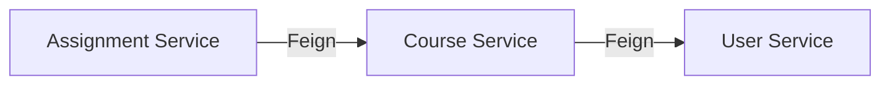

# KApp · AI Context

> Archivo de contexto para agentes de IA que trabajen en este repositorio.

---

## Proyecto

**KApp** es una plataforma universitaria para la Fundación Universitaria Konrad Lorenz, desarrollada por el club K-Forge. Arquitectura de microservicios con Spring Boot.

## Tech Stack

- **Backend:** Java 21, Spring Boot 3.2, Spring Cloud 2023.0.0
- **Discovery:** Netflix Eureka (`:8761`)
- **Gateway:** Spring Cloud Gateway (`:8080`)
- **Security:** Spring Security + JWT (JJWT 0.11.5, BCrypt)
- **IPC:** OpenFeign (service-to-service REST)
- **Resilience:** Resilience4j Circuit Breaker
- **ORM:** Spring Data JPA + Hibernate
- **Database:** PostgreSQL 15+ (Neon cloud)
- **Build:** Maven multi-module
- **Containers:** Docker + Docker Compose
- **Frontend:** HTML/JS/CSS (migrando a Angular), Kotlin (futuro), Swift (futuro)
- **Package Manager:** Bun

## Microservicios

| Servicio           | Puerto | Artifact ID        | Directorio                                  |
| ------------------ | ------ | ------------------ | ------------------------------------------- |
| Discovery Server   | 8761   | discovery-server   | `backend/microservices/discovery-server/`   |
| API Gateway        | 8080   | api-gateway        | `backend/microservices/api-gateway/`        |
| Auth Service       | 8081   | auth-service       | `backend/microservices/auth-service/`       |
| User Service       | 8082   | user-service       | `backend/microservices/user-service/`       |
| Course Service     | 8083   | course-service     | `backend/microservices/course-service/`     |
| Assignment Service | 8084   | assignment-service | `backend/microservices/assignment-service/` |
| Common Library     | —      | common             | `backend/microservices/common/`             |

## Estructura del Repositorio

```
KApp/
├── backend/
│   ├── kapp/                    # Monolito Spring Boot (legacy, no usar para nuevas features)
│   ├── microservices/           # ← Código principal
│   │   ├── pom.xml              # Parent POM (multi-module)
│   │   ├── docker-compose.yml
│   │   ├── discovery-server/
│   │   ├── api-gateway/
│   │   ├── auth-service/
│   │   ├── user-service/
│   │   ├── course-service/
│   │   ├── assignment-service/
│   │   └── common/              # DTOs + excepciones compartidas
│   └── postman/                 # Colecciones Postman para testing
├── frontend/
│   ├── web/                     # Frontend web (HTML/JS/CSS → Angular)
│   ├── kotlin/                  # App Android (futuro)
│   └── swift/                   # App iOS (futuro)
├── database/
│   ├── init.sql                 # Schema completo (enums, tablas, triggers)
│   ├── test_data.sql            # Datos de prueba
│   └── delete_all_data.sql      # Limpieza de datos
├── docs/
│   ├── REQUIREMENTS.md          # Documento de requerimientos
│   ├── DESIGN.md                # Documento de diseño arquitectónico
│   └── DOCKER-GUIDE.md          # Guía de containerización
├── scripts/
│   ├── start-backend.sh         # Arranca monolito (legacy)
│   ├── start-frontend.sh        # Arranca frontend web
│   └── start-microservices.sh   # Arranca todos los microservicios
└── PROGRESS.md                  # Estado de implementación
```

## Convenciones

- **Commits:** `[TYPE][Scope] Mensaje` (ver CONTRIBUTING.md)
- **Branches:** Git Flow (`main`, `develop`, `feature/*`, `hotfix/*`)
- **Java:** Lombok para boilerplate, DTOs en módulo `common`
- **Seguridad:** JWT en API Gateway, `X-User-Email` header a servicios internos
- **Roles:** `ROLE_STUDENT`, `ROLE_PROFESSOR`, `ROLE_ADMIN`

## Comunicación entre Servicios



- Los servicios se descubren por nombre via Eureka
- El Gateway valida JWT y agrega `X-User-Email` a todas las requests
- Los servicios internos confían en el header del Gateway

## Base de Datos

- **Schema:** Definido en `database/init.sql`
- **Tablas principales:** person, member, student, employee, course, course_group, student_course, assignment, submission, audit_log
- **Enums:** id_type, employee_type, contract_type, student_status, course_status, etc.
- **Auditoría:** Tabla `audit_log` con triggers automáticos

## Tareas Pendientes (Prioritarias)

1. Config Server centralizado (Spring Cloud Config)
2. Migrar frontend a Angular
3. Refresh tokens + logout
4. Rate limiting en Gateway
5. App Android (Kotlin)
6. App iOS (Swift)
7. CI/CD con GitHub Actions
8. Distributed Tracing (Zipkin)
9. Database-per-service
10. Kubernetes deployment

## Instrucciones para Agentes de IA

- **No tocar:** `.env` (contiene credenciales), `database/init.sql` (schema estable)
- **Monolito:** `backend/kapp/` es legacy — no agregar features aquí
- **Nuevas features:** Siempre en `backend/microservices/`
- **Frontend:** Desarrollo web actual en `frontend/web/`, migración a Angular pendiente
- **Tests:** Usar `mvn test` en cada servicio individual
- **Build:** `cd backend/microservices && mvn clean package -DskipTests`
- **Docker:** `cd backend/microservices && docker compose up -d --build`
- **Leer:** `PROGRESS.md` para estado actual, `docs/` para documentación técnica
