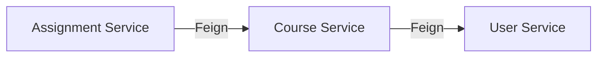

# KApp · Agent Context

> Context and instructions for AI agents working in this repository.

---

## Project Overview

**KApp** is a university platform for the Fundación Universitaria Konrad Lorenz, developed by the K-Forge club. It implements a microservices architecture using Spring Boot.

## Tech Stack

- **Backend:** Java 21, Spring Boot 3.2, Spring Cloud 2023.0.0
- **Discovery:** Netflix Eureka (`:8761`)
- **Gateway:** Spring Cloud Gateway (`:8080`)
- **Security:** Spring Security + JWT (JJWT 0.11.5, BCrypt)
- **IPC:** OpenFeign (service-to-service REST)
- **Resilience:** Resilience4j Circuit Breaker
- **ORM:** Spring Data JPA + Hibernate
- **Database:** PostgreSQL 15+ (Neon cloud)
- **Build:** Maven multi-module
- **Containers:** Docker + Docker Compose
- **Frontend:** HTML/JS/CSS (migrating to Angular), Kotlin (future), Swift (future)
- **Package Manager:** Bun

## Microservices

| Service            | Port | Artifact ID        | Directory                                       |
| ------------------ | ---- | ------------------ | ----------------------------------------------- |
| Discovery Server   | 8761 | discovery-server   | `app/backend/microservices/discovery-server/`   |
| API Gateway        | 8080 | api-gateway        | `app/backend/microservices/api-gateway/`        |
| Auth Service       | 8081 | auth-service       | `app/backend/microservices/auth-service/`       |
| User Service       | 8082 | user-service       | `app/backend/microservices/user-service/`       |
| Course Service     | 8083 | course-service     | `app/backend/microservices/course-service/`     |
| Assignment Service | 8084 | assignment-service | `app/backend/microservices/assignment-service/` |
| Common Library     | —    | common             | `app/backend/microservices/common/`             |

## Repository Structure

```text
KApp/
├── app/
│   ├── backend/
│   │   ├── kapp/                    # Legacy Spring Boot monolith (do not use for new features)
│   │   ├── microservices/           # Main application code
│   │   │   ├── pom.xml              # Parent POM (multi-module)
│   │   │   ├── docker-compose.yml
│   │   │   ├── discovery-server/
│   │   │   ├── api-gateway/
│   │   │   ├── auth-service/
│   │   │   ├── user-service/
│   │   │   ├── course-service/
│   │   │   ├── assignment-service/
│   │   │   └── common/              # Shared DTOs and exceptions
│   │   └── postman/                 # Postman collections for testing
│   ├── frontend/
│   │   ├── web/                     # Web frontend (HTML/JS/CSS → migrating to Angular)
│   │   └── mobile/
│   │       ├── kotlin/              # Android app (future)
│   │       └── swift/               # iOS app (future)
│   └── database/
│       ├── init.sql                 # Complete schema (enums, tables, triggers)
│       ├── test_data.sql            # Mock data
│       └── delete_all_data.sql      # Data cleanup script
├── docs/
│   ├── SRS.md                       # Software Requirements Specification
│   ├── REQUIREMENTS.md              # Functional and Non-Functional Requirements
│   ├── DESIGN.md                    # Architecture design and decisions
│   ├── DOCKER-GUIDE.md              # Containerization guide
│   ├── K-COLORS.md                  # Brand color palette
│   ├── PROGRESS.md                  # Implementation status
│   └── diagrams/                    # Architecture and sequence diagrams
├── scripts/
│   ├── start-frontend.sh            # Starts web frontend
│   └── start-microservices.sh       # Starts all microservices
├── CONTRIBUTING.md
├── CONTRIBUTORS.md
├── SECURITY.md
└── package.json
```

## Conventions

- **Commits:** `type: message in english` (e.g., `feat: add login screen`, `fix: resolve token bug`). Must follow Conventional Commits.
- **Branches:** Git Flow (`main`, `develop`, `feature/*`, `chore/*`, `bugfix/*`, `test/*`, `release/*`, `hotfix/*`). Refer to `CONTRIBUTING.md`.
- **Java:** Use Lombok to reduce boilerplate. DTOs and global exceptions must reside in the `common` module.
- **Security:** JWT is validated at the API Gateway. Internal requests are trusted and carry the `X-User-Email` header.
- **Roles:** `ROLE_STUDENT`, `ROLE_PROFESSOR`, `ROLE_ADMIN`.

## Versioning

Format: `MAJOR.MINOR.PATCH` (dropping unused zeros where appropriate, but recommended full structure).
- `MAJOR` for large refactors or breaking changes.
- `MINOR` for new backward-compatible features.
- `PATCH` for bug fixes.

Release flow follows standard `alpha` → `beta` → `stable` cycles. See `CONTRIBUTING.md` for branch commands.

## Inter-Service Communication



- Services are discovered by name via Eureka.
- The Gateway validates JWTs and appends the `X-User-Email` header to all routed requests.
- Internal microservices trust the header forwarded by the Gateway.

## Database Guidelines

- **Schema:** Defined in `app/database/init.sql`. Always update this file when adding new tables or columns.
- **Core Tables:** `person`, `member`, `student`, `employee`, `course`, `course_group`, `student_course`, `assignment`, `submission`, `audit_log`.
- **Enums:** `id_type`, `employee_type`, `contract_type`, `student_status`, `course_status`.
- **Auditing:** The `audit_log` table captures changes automatically via PostgreSQL triggers.

## High-Priority Tasks

1. Centralize configuration via Spring Cloud Config Server.
2. Complete frontend migration to Angular.
3. Implement refresh tokens and logout flows.
4. Add rate limiting at the Gateway level.
5. Setup CI/CD pipelines with GitHub Actions.
6. Implement Distributed Tracing (Zipkin/Sleuth).
7. Migrate to a database-per-service pattern.
8. Prepare Kubernetes deployment manifests.

## AI Agent Instructions

- **Do NOT modify:** `.env` (contains secrets).
- **Schema Stability:** Modify `app/database/init.sql` carefully. Ensure data types align with existing structures.
- **Legacy Code:** Do not add new features to `app/backend/kapp/`. It is a legacy monolith.
- **New Features:** Must be developed within `app/backend/microservices/`.
- **Frontend Code:** Current web development resides in `app/frontend/web/`.
- **Testing:** Run tests per microservice using `mvn test`.
- **Build Command:** `cd app/backend/microservices && mvn clean package -DskipTests`
- **Docker Command:** `cd app/backend/microservices && docker compose up -d --build`
- **Knowledge Sync:** Always read `docs/PROGRESS.md` to understand current progress before suggesting massive overhauls. Read `CONTRIBUTING.md` for specific formatting rules.
- **Communication:** Never use emojis in technical documents (e.g. `.md` files). Keep structures professional and formal.
