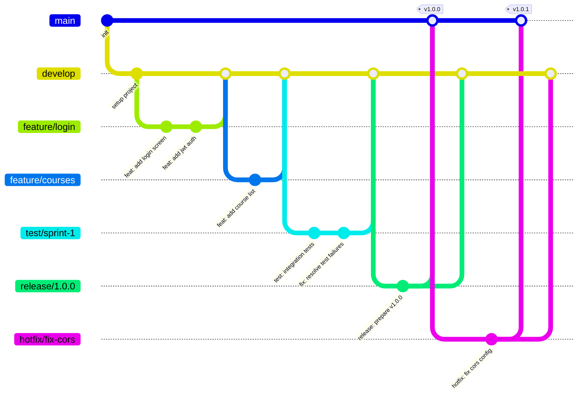

# 🛠️ Guía para Contribuir a KApp

## 🤝 ¿Quién puede contribuir?

Este proyecto es parte de K-Forge y está restringido a miembros autorizados.  
Si formas parte del equipo de desarrollo, sigue estas pautas para contribuir al código.

---

## 📌 Flujo de trabajo y convención de commits

Para mantener un historial limpio y comprensible, seguimos la convención **Git Glow** y el flujo de trabajo basado en ramas. Usa el siguiente formato para tus commits:

```
type: short message in english
```

> Todos los commits deben estar **en inglés**, en minúscula y sin corchetes.

---

### 🧾 Tipos de Commits

El _type_ indica la naturaleza del cambio realizado.

- **feat** — Nueva funcionalidad
- **fix** — Corrección de errores
- **chore** — Tareas de mantenimiento del proyecto
- **release** — Preparación de una nueva versión
- **hotfix** — Corrección urgente en producción
- **docs** — Cambios en documentación
- **refactor** — Reestructuración de código sin cambiar funcionalidad
- **test** — Agregar o modificar tests

---

### ✅ Ejemplos Correctos

- `feat: add login screen`
- `fix: resolve jwt token expiration bug`
- `chore: update spring boot dependencies`
- `docs: add branching guide to contributing`
- `refactor: extract user validation logic`
- `release: prepare version 1.0.0`

---

### ⛔ Ejemplos Incorrectos

- `update` → No describe nada útil
- `[FEAT][UI] Agregar pantalla` → No usar corchetes ni español
- `Fix bug` → Debe ser minúscula: `fix: ...`
- `cambios varios` → Muy ambiguo y en español

---

## 🌿 Ramas (Branching)

Seguimos **Git Flow**. Todas las ramas deben partir de `develop` (excepto `hotfix/*`, que parte de `main`).

### Diagrama de ramas



### Tipos de ramas

| Rama        | Base      | Se mergea a          | Uso                              |
| ----------- | --------- | -------------------- | -------------------------------- |
| `main`      | —         | —                    | Producción estable               |
| `develop`   | `main`    | `main` (via release) | Integración de features          |
| `feature/*` | `develop` | `develop`            | Nueva funcionalidad              |
| `test/*`    | `develop` | `develop`            | Pruebas de integración / QA      |
| `hotfix/*`  | `main`    | `main` + `develop`   | Corrección urgente en producción |
| `release/*` | `develop` | `main` + `develop`   | Preparación de una versión       |

### Crear una rama

```bash
# Feature nueva
git checkout develop
git pull origin develop
git checkout -b feature/login-screen

# Hotfix urgente
git checkout main
git pull origin main
git checkout -b hotfix/fix-jwt-expiration

# Test / QA
git checkout develop
git pull origin develop
git checkout -b test/sprint-1

# Release
git checkout develop
git checkout -b release/1.2.0
```

### Nombrar ramas

Usa kebab-case descriptivo después del prefijo:

✅ **Correcto:**

- `feature/student-dashboard`
- `feature/assignment-submission-api`
- `hotfix/fix-cors-gateway`
- `test/sprint-3`
- `release/2.0.0`

⛔ **Incorrecto:**

- `feature/changes` → Muy vago
- `mi-rama` → Sin prefijo
- `feature/StudentDashboard` → No usar camelCase
- `feat/login` → Usar `feature`, no `feat`

### Flujo completo (ejemplo)

```bash
# 1. Crear la rama desde develop
git checkout develop
git pull origin develop
git checkout -b feature/course-enrollment

# 2. Hacer commits siguiendo la convención
git add .
git commit -m "feat: add course enrollment endpoint"

git add .
git commit -m "feat: add enrollment screen"

# 3. Push de la rama
git push origin feature/course-enrollment

# 4. Crear Pull Request en GitHub → develop
# 5. Tras aprobación, mergear y eliminar la rama
```

---

📚 Para más información sobre Git Glow, visita [GitHub - Git Glow](https://github.com/arthurdenner/git-glow) o consulta la documentación interna del equipo.

---

<!-- Los scripts de instalación de hooks se encuentran en la carpeta scripts/ y están diferenciados por plataforma: macos-git-glow.sh y windows-git-glow.ps1. -->
