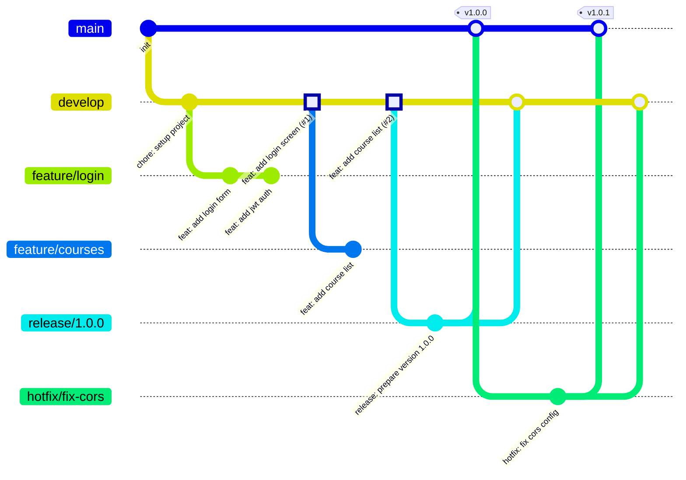

<br/>

> **Fuente canonica:** [K-Forge/.github/CONTRIBUTING.md](https://github.com/K-Forge/.github/blob/main/CONTRIBUTING.md).
> Cada repositorio de proyecto lleva una **copia exacta** de este archivo en su raiz, porque los archivos de la
> organizacion no viajan al clonar y ni las personas ni los agentes de IA los ven en local. Edita solo la canonica;
> las copias se actualizan con `scripts/sync-contributing.sh` del repositorio correspondiente.

<br/>

## ◈ Antes de empezar

1. Se miembro activo de K-Forge o solicita acceso en [kforge.dev@gmail.com](mailto:kforge.dev@gmail.com).
2. Configura git con **tu** nombre y el correo de tu cuenta de GitHub, para que cada commit quede a tu nombre:

   ```bash
   git config --global user.name "Tu Nombre"
   git config --global user.email "tu-correo@ejemplo.com"
   ```

3. Clona el repositorio y, si trae `scripts/install-git-hooks.sh`, ejecutalo una vez. Git no instala hooks por su
   cuenta al clonar: sin ese paso nadie revisa tus commits hasta que abres la Pull Request.
4. Lee este documento completo.

> **Donde se aplican estas reglas.** El hook local revisa cada commit en tu maquina (macOS, Linux o Windows con Git
> Bash) y sirve para enterarte antes; no es una garantia, porque depende de haberlo instalado. La garantia esta en
> GitHub: las reglas de `main` y `develop` y los checks de CI se aplican a todos por igual, desde cualquier sistema,
> editor o cliente de git.

<br/>

## ◈ Convencion para Commits

Seguimos **Conventional Commits** con reglas propias. Formato de la primera linea:

```
type: short message in english
```

> En **ingles**, en **minusculas**, sin punto final y sin scopes entre parentesis. Maximo **72 caracteres**. Los
> identificadores de codigo (clases, variables, rutas) conservan su grafia original. Se escribe en **imperativo**,
> como una orden: `add`, `fix`, `remove`; no `added` ni `fixes`.

### Tipos de Commits

| Tipo       | Descripcion                                                  |
| ---------- | ------------------------------------------------------------ |
| `feat`     | Nueva funcionalidad                                          |
| `fix`      | Correccion de errores                                        |
| `chore`    | Tareas de mantenimiento del proyecto                         |
| `release`  | Preparacion de una nueva version                             |
| `hotfix`   | Correccion urgente en produccion                             |
| `docs`     | Cambios en documentacion                                     |
| `refactor` | Refactorizacion de codigo sin cambiar comportamiento         |
| `test`     | Agregar o modificar tests                                    |

### Ejemplos correctos

```
feat: add login screen
fix: resolve jwt token expiration bug
chore: update spring boot dependencies
docs: add branching guide to contributing
refactor: extract user validation logic
test: add integration tests for user service
release: prepare version 1.0.0
hotfix: fix cors config in gateway
```

### Ejemplos incorrectos

| Ejemplo | Problema |
|---|---|
| `update` | No describe nada util |
| `cambios` | Ambiguo y no esta en ingles |
| `FEAT: Add product` | No usar mayusculas |
| `feat(api): add product` | No usar scopes entre parentesis |
| `feat: Add Product.` | No usar mayusculas ni punto final |
| `fix: fixed the bug` | Vago — que bug, donde — y no esta en imperativo |
| `Hotfix: fix cors config` | El tipo va en minusculas |
| `design: draw the login screen` | `design` no es un tipo permitido |
| `wip: partial auth layer` | Los commits de trabajo a medias no se suben |

### Que tipo uso?

Solo existen los ocho tipos de la tabla. Otros tipos habituales de Conventional Commits (`ci`, `build`, `style`,
`perf`) **no se usan** en K-Forge. Equivalencias para los casos que mas se confunden:

| Cambio | Tipo |
|---|---|
| Pipelines de CI, Dockerfiles, scripts de build, dependencias | `chore` |
| Estilos visuales o ajustes de interfaz que el usuario ve | `feat` (nuevo) o `fix` (corrige) |
| Mockups, disenos o diagramas dentro del repositorio | `docs` |
| Formato de codigo sin cambio de comportamiento | `refactor` |
| Trabajo de una plataforma concreta (`ios`, `android`, `web`) | La plataforma no es un tipo: `feat` o `fix` |
| Trabajo a medias | No se sube como commit. Usa una PR en borrador (ver Pull Requests) |
| Revertir un cambio | `fix: revert <descripcion del cambio>` |

### Anatomia de un commit

```
feat: add course enrollment endpoint

Students could see a course but not enroll in it. The endpoint checks
prerequisites before writing, so an ineligible enrollment is refused
instead of stored.

Closes #42
```

- **Primera linea:** el **que**, con la convencion de arriba.
- **Cuerpo** (opcional, tras una linea en blanco): el **por que**, en ingles, en lineas de unos 72 caracteres.
- **Pie** (opcional, tras otra linea en blanco): issues (`Closes #42`), coautores **personas** (`Co-Authored-By:` con
  el correo de la persona) y cambios incompatibles (`BREAKING CHANGE: <que se rompe y como migrar>`).

### Commits atomicos

- **Un commit, un cambio con sentido propio.** Si el mensaje necesita un "and", probablemente son dos commits.
- **Agrega archivos por nombre** (`git add <archivo>`) o por partes (`git add -p`), y revisa `git status` antes de
  commitear. `git add .` es la forma en que terminan en el repositorio archivos que nadie queria subir.
- **Nunca se suben:** `.env` ni ningun secreto, `local.properties`, carpetas de build (`build/`, `target/`, `dist/`,
  `node_modules/`), configuracion personal del IDE (`.idea/`, `xcuserdata/`) ni archivos del sistema (`.DS_Store`,
  `Thumbs.db`). Si aparecen en `git status`, se agregan al `.gitignore` en vez de commitearlos.

<br/>

## ◈ Estrategia de Ramas y Flujo (Git Flow)

Usamos **Git Flow**. Regla base: casi todo sale de `develop`; solo `hotfix/*` sale de `main`.

> **Nadie hace push directo a `main` ni a `develop`, incluidos los administradores.** Todo entra por Pull Request.
> Si un repositorio permite saltarse esta regla, es un error de configuracion y se corrige, no se aprovecha.

### Visual rapido del flujo

Las ramas de trabajo entran a `develop` con **squash**: toda la rama queda en un solo commit (resaltado) y la rama se
borra. Las versiones entran a `main` con **merge commit** y un tag, y vuelven a `develop` de la misma forma.


```mermaid
gitGraph
   commit id: "init"
   branch develop
   checkout develop
   commit id: "chore: setup project"
   branch feature/login
   checkout feature/login
   commit id: "feat: add login form"
   commit id: "feat: add jwt auth"
   checkout develop
   commit id: "feat: add login screen (#1)" type: HIGHLIGHT
   branch feature/courses
   checkout feature/courses
   commit id: "feat: add course list"
   checkout develop
   commit id: "feat: add course list (#2)" type: HIGHLIGHT
   branch release/1.0.0
   checkout release/1.0.0
   commit id: "release: prepare version 1.0.0"
   checkout main
   merge release/1.0.0 tag: "v1.0.0"
   checkout develop
   merge release/1.0.0
   checkout main
   branch hotfix/fix-cors
   checkout hotfix/fix-cors
   commit id: "hotfix: fix cors config"
   checkout main
   merge hotfix/fix-cors tag: "v1.0.1"
   checkout develop
   merge hotfix/fix-cors
```

### Tipos de ramas y uso correcto

| Rama        | Para que se usa                                 | Crear desde | PR/Merge hacia      | Eliminar |
| ----------- | ----------------------------------------------- | ----------- | ------------------- | -------- |
| `main`      | Codigo estable en produccion                    | —           | —                   | Nunca    |
| `develop`   | Integracion de trabajo diario                   | `main`      | `main` (via release)| Nunca    |
| `feature/*` | Nueva funcionalidad                             | `develop`   | `develop`           | Tras merge a `develop` |
| `bugfix/*`  | Bug no urgente detectado en desarrollo          | `develop`   | `develop`           | Tras merge a `develop` |
| `chore/*`   | Mantenimiento (docs, CI/CD, deps, configs)      | `develop`   | `develop`           | Tras merge a `develop` |
| `test/*`    | Pruebas temporales o validaciones tecnicas      | `develop`   | `develop` (si aplica)| Tras merge o al descartar |
| `release/*` | Preparar version (ajustes finales, versionado)  | `develop`   | `main` y `develop`  | Tras merge a ambos |
| `hotfix/*`  | Incidente urgente en produccion                 | `main`      | `main` y `develop`  | Tras merge a ambos |

> `hotfix/*` es **solo** para incidentes en produccion. Si el proyecto aun no tiene despliegue en produccion, no
> existen hotfixes: la correccion es un `bugfix/*` hacia `develop`.

### Convencion de nombres

Formato: `<tipo>/<descripcion-en-kebab-case>`, en ingles. Las versiones usan el numero: `release/1.2.0`.

```
feature/student-dashboard
bugfix/fix-null-pointer-product
chore/update-spring-dependencies
hotfix/fix-cors-gateway
release/1.2.0
release/1.0.0-beta.1

feature/changes      (incorrecto: muy vago)
mi-rama              (incorrecto: sin prefijo)
feature/StudentDash  (incorrecto: no kebab-case)
feat/login           (incorrecto: usar feature/*)
```

### Estrategia de merge

| Pull Request | Metodo | Por que |
|---|---|---|
| `feature/*`, `bugfix/*`, `chore/*`, `test/*` → `develop` | **Squash and merge** | `develop` queda con un commit por PR. El **titulo de la PR se convierte en el commit**, asi que debe cumplir la convencion |
| `release/*`, `hotfix/*` → `main` | **Create a merge commit** | Conserva la historia comun entre `main` y `develop`; un squash las separa para siempre |
| `release/*`, `hotfix/*` → `develop` | **Create a merge commit** | Mismo motivo: la vuelta a `develop` debe compartir los commits de `main` |

**Nunca** se usa "Rebase and merge".

### Flujo de trabajo de principio a fin

```bash
# 1) Parte de develop actualizado
git switch develop && git pull

# 2) Crea tu rama
git switch -c feature/course-enrollment

# 3) Commits atomicos: agrega por nombre y revisa antes de commitear
git add src/enrollment/EnrollmentController.java
git status
git commit -m "feat: add course enrollment endpoint"

# 4) Publica la rama y abre la PR hacia develop (en GitHub o con la CLI gh)
git push -u origin feature/course-enrollment
gh pr create --base develop --title "feat: add course enrollment endpoint"
```

Cuando la PR tiene la aprobacion y los checks en verde, **la fusiona su autor**:

1. Elige **Squash and merge**. GitHub propone el titulo de la PR mas `(#numero)`: verifica que cumpla la convencion.
2. En el cuerpo, **borra la lista automatica de commits** y cualquier linea de atribucion de herramientas. Dejalo
   vacio o con un parrafo del por que; conserva las lineas `Co-authored-by` de personas.
3. Limpia tu copia local:

```bash
git switch develop && git pull
git branch -D feature/course-enrollment
```

> Se usa `-D` y no `-d`: con squash, los commits de tu rama no estan en `develop`, asi que git no la reconoce como
> fusionada. **Una rama fusionada no se reutiliza:** el siguiente trabajo sale en una rama nueva desde `develop`.

### Mantener tu rama al dia

Si `develop` avanzo mientras trabajabas, reaplica tus commits encima:

```bash
git fetch origin
git rebase origin/develop
git push --force-with-lease
```

- `--force-with-lease`, **nunca** `--force`: se niega a sobrescribir si alguien mas empujo a tu rama.
- Solo se reescribe **tu propia** rama. Si la comparten varias personas, usa `git merge origin/develop`; esos merge
  commits desaparecen con el squash.
- `main` y `develop` nunca se reescriben.

### Ordenar los commits antes de la PR

Si tienes commits con mensajes que no cumplen la convencion o trabajo a medias, corrigelos **antes** de pedir revision:

```bash
# Solo el ultimo commit
git commit --amend -m "feat: add course enrollment endpoint"

# Varios commits: reword para renombrar, squash o fixup para unir
git rebase -i origin/develop

git push --force-with-lease
```

Sin editor interactivo, puedes rehacer todo en un solo commit conservando los cambios:

```bash
git reset --soft "$(git merge-base HEAD origin/develop)"
git commit -m "feat: add course enrollment endpoint"
git push --force-with-lease
```

### Ramas que dependen de otra rama

1. Crea tu rama desde la rama padre y abre tu PR **contra la rama padre**, no contra `develop`. Asi la revision
   muestra solo tus cambios.
2. Cuando la padre se fusiona con squash, sus commits originales siguen dentro de tu rama y chocarian con el commit
   squash de `develop`. Mueve **solo tus commits** encima de `develop`, usando la padre tal como estaba antes del merge:

   ```bash
   git fetch origin
   git rebase --onto origin/develop feature/rama-padre feature/tu-rama
   git push --force-with-lease
   ```

3. Cambia la base de tu PR a `develop` (boton **Edit** junto al titulo).

### Release paso a paso

```bash
git switch develop && git pull
git switch -c release/1.2.0
# Solo ajustes finales: numero de version, changelog, correcciones menores
git commit -m "release: prepare version 1.2.0"
git push -u origin release/1.2.0
```

1. PR `release/1.2.0` → `main`, fusionada con **Create a merge commit**.
2. Tag de la version sobre ese merge:

   ```bash
   git switch main && git pull
   git tag -a v1.2.0 -m "release: version 1.2.0"
   git push origin v1.2.0
   ```

3. PR `release/1.2.0` → `develop`, fusionada con **Create a merge commit**. Si hay conflictos, se resuelven en la rama
   `release/*` (`git merge origin/develop`), nunca con push a `develop`.

Un `hotfix/*` sigue los mismos tres pasos, pero nace de `main` y sube el `PATCH` (`v1.2.1`).

### Meta-repositorios

`.github` y `.github-private` no tienen codigo ni versiones: solo tienen `main`, y todo cambio entra por PR hacia
`main` desde una rama `chore/*`.

<br/>

## ◈ Versionamiento

Seguimos **SemVer** (Semantic Versioning) con formato `MAJOR.MINOR.PATCH`. Los tags llevan prefijo `v`: `v1.2.0`.

| Segmento | Cuando incrementar                                | Ejemplo            |
| -------- | ------------------------------------------------- | ------------------ |
| `MAJOR`  | Cambios incompatibles con versiones anteriores    | `1.0.0` → `2.0.0`  |
| `MINOR`  | Nueva funcionalidad compatible hacia atras        | `1.0.0` → `1.1.0`  |
| `PATCH`  | Correcciones de errores en produccion (hotfix)    | `1.1.0` → `1.1.1`  |

### Versiones Pre-release

```
1.0.0-alpha.1    → Primera iteracion en desarrollo
1.0.0-beta.1     → Primera version en pruebas
1.0.0            → Version estable
```

Ciclo: **alpha** → **beta** → **release candidate** → **stable** → **maintenance / patch**

<br/>

## ◈ Pull Requests

- **Titulo** siguiendo la convencion de commits. Con squash, el titulo es el mensaje del commit que queda en `develop`.
- **Rama base correcta** segun la tabla de ramas: `develop` para casi todo; `main` solo para `release/*` y `hotfix/*`.
- **Descripcion** breve de **que** cambia y **por que**. Vincula el issue relacionado si existe.
- **PRs pequenas.** Si pasa de unas 400 lineas cambiadas o mezcla temas, dividela: una revision grande se aprueba sin
  leerse.
- **Trabajo a medias en borrador.** Abre la PR como **Draft** para mostrar avance o pedir opinion temprano, en lugar de
  subir commits `wip`. Pasala a **Ready for review** cuando este lista.
- **Checks de CI en verde** para fusionar.
- **Aprobacion de al menos 1 miembro** distinto del autor. Las conversaciones abiertas se resuelven antes de fusionar.
- **Fusiona el autor**, con el metodo de la tabla de estrategia de merge.
- **Revertir:** el boton **Revert** de GitHub propone el titulo `Revert "..."`; cambialo a `fix: revert <descripcion>`.

<br/>

## ◈ Agentes de IA

Los agentes de IA siguen **exactamente las mismas reglas** que las personas. Ademas:

- **Lee el `CONTRIBUTING.md` de la raiz del repositorio** antes de crear una rama, un commit o una PR. Es la copia
  local de este documento y la unica que un agente puede ver.
- **El autor del commit es el miembro humano.** Nunca configures `user.name` ni `user.email` con la identidad de la
  herramienta. El check rechaza commits firmados por identidades automaticas.
- **Prohibida la atribucion de herramientas.** Ni en commits, ni en titulos o descripciones de PR, ni en codigo, ni en
  documentacion: nada de trailers `Co-Authored-By` hacia una herramienta, firmas, lineas de "generado con" ni
  menciones del asistente usado. El historial registra **que** hizo el equipo, no con que se escribio.

- **Una sesion, un worktree.** Dos agentes en la misma carpeta comparten indice y archivos: se pisan los cambios. Cada
  sesion trabaja en su propio `git worktree` y en su propia rama.
- **Nunca commitees en `main` ni en `develop`.** Trabaja en una rama con el prefijo correcto.
- **No hagas push, no abras PRs y no fusiones** sin la aprobacion explicita del miembro que dirige la sesion.
- **Nunca uses `--no-verify` ni `--force`.** Si el hook rechaza un commit, corrige el mensaje o la rama. Reescribir una
  rama con `--force-with-lease` tambien requiere aprobacion.
- **Sin commits `wip:`.** Si la sesion se interrumpe, deja los cambios sin commitear o en un commit que cumpla la
  convencion. Para ordenar commits sin editor interactivo, usa la receta con `git reset --soft` de arriba.

<br/>

## ◈ Estandares de codigo

Reglas generales aplicables a todos los proyectos del ecosistema:

| Elemento | Convencion |
|---|---|
| Clases, componentes | PascalCase |
| Metodos, funciones, variables | camelCase |
| Constantes | UPPER_SNAKE_CASE |
| Paquetes / modulos | minusculas |
| Indentacion JS/TS | 2 espacios |
| Indentacion Java/Kotlin | 4 espacios |
| Imports sin usar | Eliminar siempre |
| Credenciales en codigo | Nunca — usar `.env` |
| Codigo comentado sin uso | Eliminar antes del PR |

Cada proyecto define sus estandares especificos de framework en su `AGENTS.md`.

<br/>

## ◈ Reporte de bugs

Abre un **Issue** con:

- Descripcion del problema.
- Pasos para reproducirlo.
- Comportamiento esperado vs. actual.
- Capturas de pantalla si aplica.

<br/>

---

<div align="center">
  
  <br/>
  <a href="https://github.com/K-Forge">
    
  </a>
  &nbsp;
  <a href="https://kforge.vercel.app">
    
  </a>
  &nbsp;
  <a href="mailto:kforge.dev@gmail.com">
    
  </a>
  <br/><br/>
  <a href="#top">
    
  </a>
</div>
