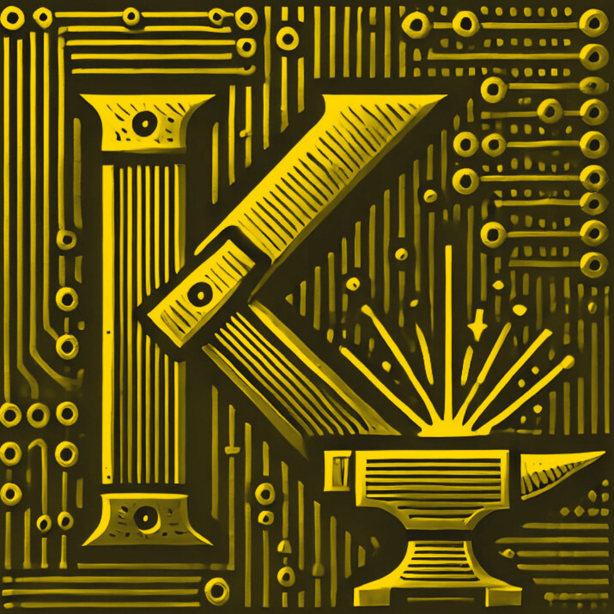
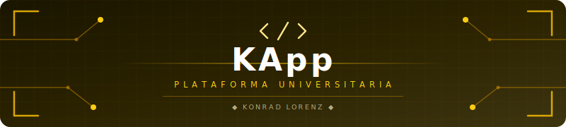

<a id="top"></a>

<table width="100%" style="border: none; background-color: transparent;">
  <tr style="border: none; background-color: transparent;">
    <td align="center" width="20%" style="border: none; padding: 0;">
      
    </td>
    <td align="center" width="80%" style="border: none; padding: 0;">
      
    </td>
  </tr>
</table>

<p align="center"><strong>Plataforma universitaria de la Fundación Universitaria Konrad Lorenz para gestionar procesos académicos y administrativos.</strong></p>

<p align="center">
  
  
  
  
  
  
</p>

---

## Tabla de Contenidos

- [Descripción](#descripción)
- [Inicio rápido](#inicio-rápido)
- [Comandos npm](#comandos-npm)
- [Arquitectura](#arquitectura)
- [Contributing](#contributing)
- [Contributors](#contributors)
- [Licencia](#licencia)

---

## Descripción

KApp es una plataforma integral desarrollada por el equipo K-Forge para la Fundación Universitaria Konrad Lorenz. Implementa una arquitectura robusta de microservicios en Spring Boot con autenticación centralizada por JWT en el API Gateway. El backend se encuentra operativo proveyendo servicios escalables, y el frontend web actual (en `HTML/CSS/JS`) se está migrando progresivamente hacia Angular para mejorar la reactividad y la experiencia de usuario.

---

## Inicio rápido

Para inicializar y ejecutar el proyecto en ambiente local, utiliza los comandos definidos en `package.json`.

### 1. Clonar el repositorio e instalar herramientas
Asegúrate de contar con Java 21, Maven, Docker, PostgreSQL 15+, pnpm y Bun instalados.
```bash
# Habilitar Corepack y activar pnpm
corepack enable && corepack prepare pnpm@latest --activate

# Instalar dependencias del repositorio
pnpm install
```

### 2. Levantar microservicios
```bash
pnpm run microservices:start
```

Ver estado y detener servicios:
```bash
pnpm run microservices:status
pnpm run microservices:stop
```

### 3. Levantar frontend web
```bash
pnpm run web:start:script
```

---

## Comandos npm

Comandos recomendados (nueva convención explícita):

| Comando | Descripción |
| ------- | ----------- |
| `pnpm run web:dev` | Sirve `app/frontend/web` en modo desarrollo con `serve`. |
| `pnpm run web:start` | Sirve el frontend en puerto `3000` con SPA fallback (`-s`). |
| `pnpm run web:start:script` | Levanta frontend usando `scripts/start-frontend.sh` (permite `PORT`). |
| `pnpm run microservices:start` | Inicia microservicios en orden con health checks. |
| `pnpm run microservices:status` | Consulta estado de los microservicios. |
| `pnpm run microservices:stop` | Detiene microservicios iniciados por script. |
| `pnpm run backend:legacy:start` | Inicia el backend monolítico legado (`app/backend/kapp`). |

Compatibilidad (alias heredados):

| Alias | Equivalente recomendado |
| ----- | ----------------------- |
| `pnpm run dev:web` | `pnpm run web:dev` |
| `pnpm run start:web` | `pnpm run web:start` |
| `pnpm run start:frontend` | `pnpm run web:start:script` |
| `pnpm run start:microservices` | `pnpm run microservices:start` |
| `pnpm run start:backend` | `pnpm run backend:legacy:start` |

---

## Arquitectura

La plataforma sigue un diseño orientado a microservicios para garantizar alta disponibilidad y una clara separación de responsabilidades.

| Capa            | Tecnologías principales                                                                |
| --------------- | -------------------------------------------------------------------------------------- |
| Backend         | Java 21, Spring Boot 3.2, Spring Cloud 2023.0.0                                        |
| Seguridad       | Spring Security, JWT (JJWT), BCrypt                                                    |
| Persistencia    | Spring Data JPA, Hibernate, PostgreSQL 15+                                             |
| Infraestructura | Eureka, Spring Cloud Gateway, OpenFeign, Resilience4j, Docker                          |
| Frontend        | Web (`HTML/CSS/JS`, migrando a Angular), Android (Kotlin, futuro), iOS (Swift, futuro) |

Los servicios principales alojados en `app/backend/microservices/` son:
- **Discovery Server (8761)**: Registro y descubrimiento de servicios mediante Eureka.
- **API Gateway (8080)**: Punto de entrada único, enrutamiento y validación JWT.
- **Auth Service (8081)**: Autenticación, registro y emisión de tokens.
- **User Service (8082)**: Gestión centralizada de usuarios y perfiles.
- **Course Service (8083)**: Administración de cursos, grupos y matrículas.
- **Assignment Service (8084)**: Tareas, entregas y proceso de calificaciones.
- **Common Library**: Módulo transversal de DTOs y excepciones estandarizadas.

---

## Contributing

El mantenimiento de este código está restringido estrictamente a miembros autorizados de K-Forge y la Fundación Universitaria Konrad Lorenz. No se aceptan Pull Requests de usuarios externos ajenos al proyecto.

Si eres miembro autorizado:
- Revisa las reglas de convenciones de commits y ramas (`feature/*`, `bugfix/*`).
- Todo cambio en el esquema debe reflejarse en `app/database/init.sql`.
- El monolito antiguo bajo `app/backend/kapp/` se encuentra congelado y no se deben añadir nuevas funciones allí. Todo desarrollo debe apuntar a la carpeta `app/backend/microservices/`.

---

## Contributors

Agradecimientos a los miembros del club que forjan e impulsan este proyecto de software.

<table>
  <tr>
    <td align="center"><a href="https://github.com/13rianVargas"><br /><sub><b>Brian Vargas</b></sub></a></td>
    <td align="center"><a href="https://github.com/SantiagoRR17"><br /><sub><b>SantiagoRR17</b></sub></a></td>
    <td align="center"><a href="https://github.com/MaferVaRey"><br /><sub><b>MaferVaRey</b></sub></a></td>
    <td align="center"><a href="https://github.com/DIEGO-ALI"><br /><sub><b>DIEGO-ALI</b></sub></a></td>
    <td align="center"><a href="https://github.com/Landrea28"><br /><sub><b>Landrea28</b></sub></a></td>
  </tr>
</table>

---

## Licencia

Proyecto bajo [Licencia de Uso Interno](LICENSE).

© 2026 K-Forge Developers. Todos los derechos reservados.
El uso, modificación y distribución están restringidos según los términos definidos por el equipo KApp/K-Forge para la Fundación Universitaria Konrad Lorenz.

---

<div align="center">
  <br>
  <a href="https://github.com/K-Forge">
    
  </a>
  &nbsp;
  <a href="https://kforge.vercel.app">
    
  </a>
  &nbsp;
  <a href="mailto:kforge.dev@gmail.com">
    
  </a>
  <br><br>
  <sub>Forjado por <a href="https://github.com/K-Forge"><strong>K-Forge</strong></a> — Club de desarrollo de la Konrad Lorenz</sub>
  <br><br>
  <a href="#top">
    
  </a>
  <br><br>
  
</div>
