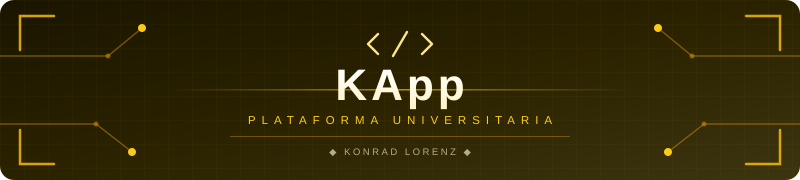
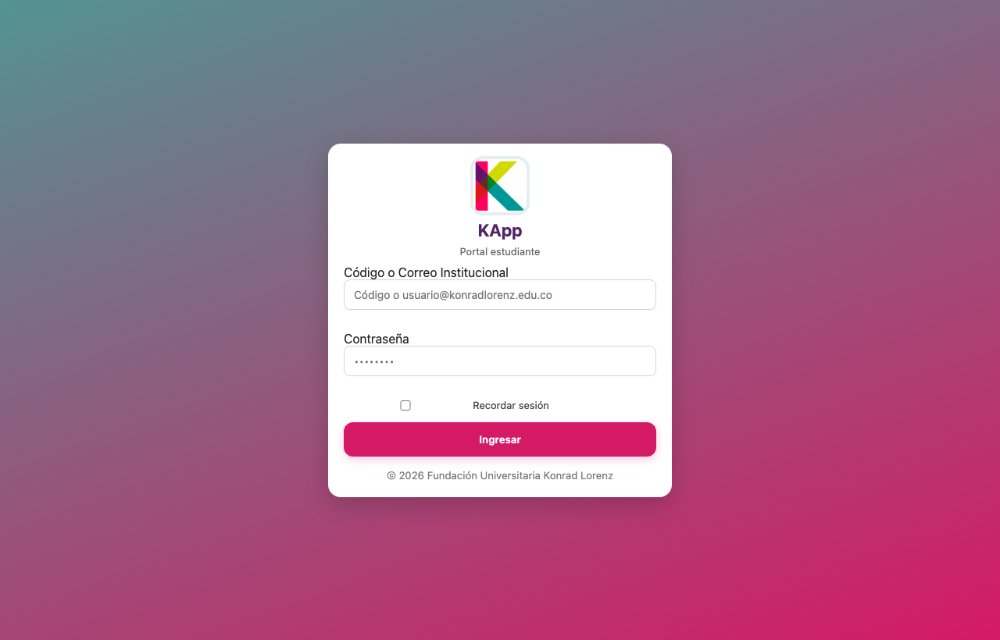
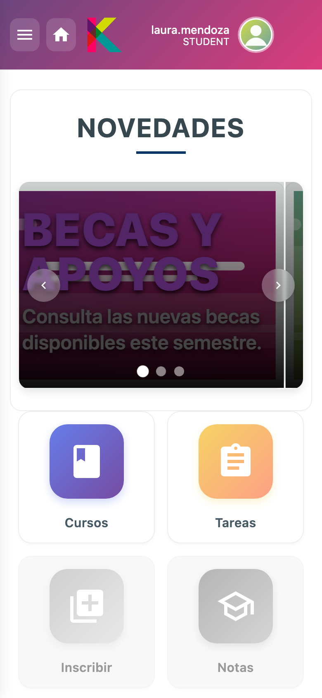
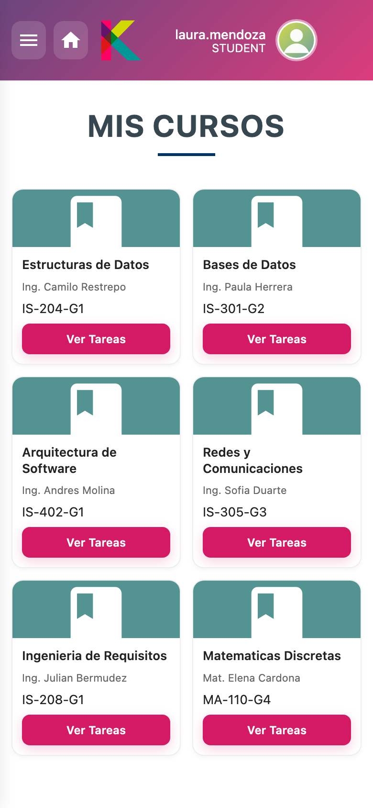
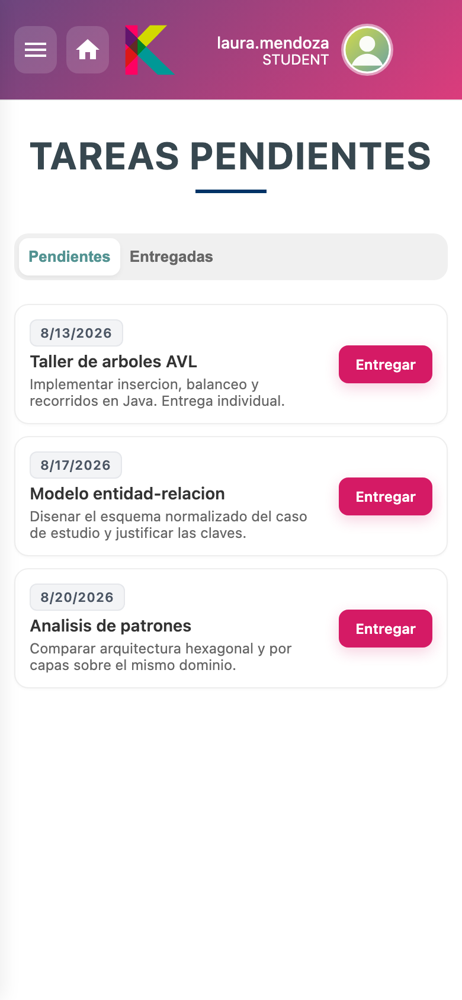
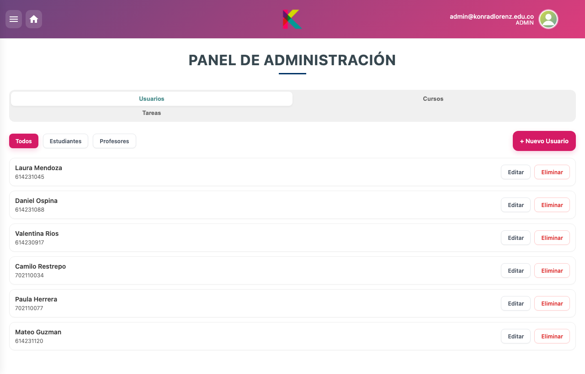
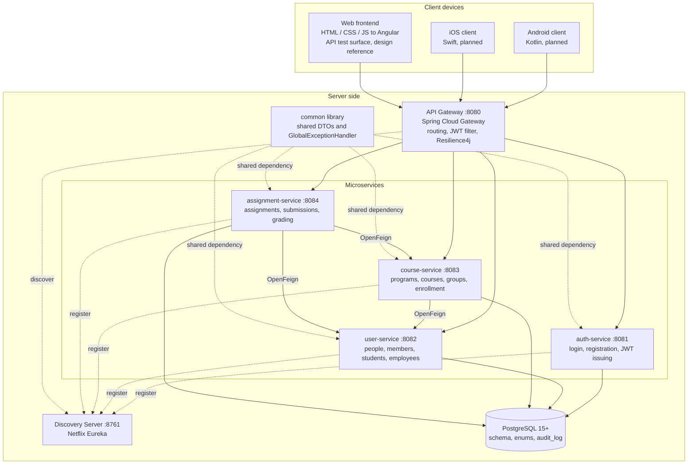
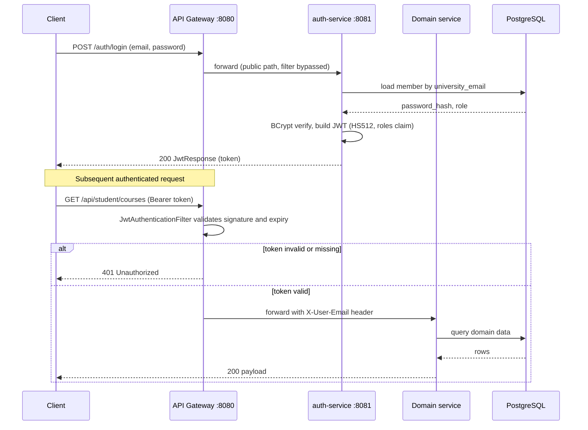

<a id="top"></a>

<table width="100%" style="border: none; background-color: transparent;">
  <tr style="border: none; background-color: transparent;">
    <td align="center" width="20%" style="border: none; padding: 0;">
      
    </td>
    <td align="center" width="80%" style="border: none; padding: 0;">
      
    </td>
  </tr>
</table>

<p align="center"><strong>University mobile app for Fundación Universitaria Konrad Lorenz. Native Android (Kotlin) and iOS (Swift) clients, powered by a server-side Spring Boot microservices backend with JWT and PostgreSQL.</strong></p>

<p align="center">
  <a href="https://github.com/K-Forge/KApp/actions/workflows/ci.yml"></a>
  &nbsp;
  <a href="https://kapp-black.vercel.app"></a>
  <br/><br/>
  
  
  
  
  
  
  
  
  
</p>

---

## Table of Contents

- [Overview](#overview)
- [Project Status](#project-status)
- [Interface](#interface)
- [System Architecture](#system-architecture)
- [Key Features](#key-features)
- [Tech Stack](#tech-stack)
- [Getting Started](#getting-started)
- [Project Structure](#project-structure)
- [Documentation](#documentation)
- [Security](#security)
- [Contributing](#contributing)
- [Contributors](#contributors)
- [License](#license)

---

## Overview

KApp is the **university mobile application** for the Fundación Universitaria Konrad Lorenz community, developed by
the K-Forge development club. The product is mobile-first: native **Android (Kotlin)** and **iOS (Swift)** clients
give students and staff access to their academic life from their phones — identity and authentication, user and
profile administration, course and group enrollment, and the assignment/submission/grading cycle.

The clients are thin. Everything they consume lives **server-side, as a Spring Boot microservices backend**: six
independent services register with a Eureka discovery server and are reached through a single API Gateway that
centralizes routing and JWT validation. Services communicate over REST through OpenFeign clients, share a common
library of DTOs and exception handling, and persist to a PostgreSQL 15+ schema with enumerated types, audit triggers
and referential integrity enforced at database level.

Delivery is sequenced deliberately: **backend first, web second, mobile third**. The web frontend — plain
HTML/CSS/JS, migrating to Angular — exists to exercise and validate the API end to end while the backend is being
built, and to settle the interface design. Once that design is stable it gets ported to the native Kotlin and Swift
clients, which are the final product.

---

## Project Status

KApp started as an idea intended to become a **degree thesis project**, and it is currently in the
**pre-proposal and documentation phase** (_anteproyecto_).

What that means when reading this repository:

- The research and specification work is the primary deliverable at this stage. It lives in [`docs/`](docs/):
  software requirements specification, functional requirements, system design, and a study of academic database
  models.
- The backend published here is a **working architectural reference prototype**, validated locally. Its purpose is
  to prove that the proposed architecture holds, not to serve production traffic.
- The native clients are **not implemented yet**, by design: `app/frontend/mobile/kotlin/` and
  `app/frontend/mobile/swift/` hold placeholders. The current phase is backend plus the web client that tests it;
  the mobile clients come after the interface design settles, which is why they sit at low priority in
  [docs/PROGRESS.md](docs/PROGRESS.md) despite being the end product.
- There is **no production deployment**. Configuration defaults target local development, and the platform has not
  been hardened for a public-facing environment. See [Security](#security).
- The original Spring Boot monolith was removed once the migration to microservices completed. It remains
  retrievable from the git history; `app/backend/microservices/` is the only backend.

---

## Interface

The web client is where the API is exercised end to end, and it holds the interface design that the Kotlin and
Swift clients will inherit. The screens below run against the microservices backend; the data shown is sample data.

A **live demo** of these screens runs at **[kapp-black.vercel.app](https://kapp-black.vercel.app)** — sign in with
any credentials. It is powered by a demo mode ([`js/demo.js`](app/frontend/web/js/demo.js)) that answers the API
with sample data when no backend is reachable, so the interface can be browsed by anyone. The mode stays inert
during local development — see [Demo mode](#demo-mode).

<table>
  <tr>
    <td width="50%" align="center">
      
      <br/><sub><b>Authentication</b> — institutional credentials, JWT issued by <code>auth-service</code></sub>
    </td>
    <td width="50%" align="center">
      
      <br/><sub><b>Dashboard</b> — announcements and role-aware navigation</sub>
    </td>
  </tr>
  <tr>
    <td width="50%" align="center">
      
      <br/><sub><b>Courses</b> — enrollment served by <code>course-service</code></sub>
    </td>
    <td width="50%" align="center">
      
      <br/><sub><b>Assignments</b> — pending and submitted work from <code>assignment-service</code></sub>
    </td>
  </tr>
  <tr>
    <td colspan="2" align="center">
      
      <br/><sub><b>Administration</b> — user, course and assignment management, rendered only for the admin role</sub>
    </td>
  </tr>
</table>

---

## System Architecture

The mobile clients run on the user's device; every service runs on the server side. The gateway is the only
component exposed to clients, and service locations are resolved dynamically through Eureka instead of being
hardcoded.


```mermaid
flowchart TB
    subgraph clients["Client devices"]
        AND["Android client<br/>Kotlin, planned"]
        IOS["iOS client<br/>Swift, planned"]
        WEB["Web frontend<br/>HTML / CSS / JS to Angular<br/>API test surface, design reference"]
    end

    subgraph server["Server side"]
        GW["API Gateway :8080<br/>Spring Cloud Gateway<br/>routing, JWT filter, Resilience4j"]
        EUR["Discovery Server :8761<br/>Netflix Eureka"]

        subgraph services["Microservices"]
            AUTH["auth-service :8081<br/>login, registration, JWT issuing"]
            USER["user-service :8082<br/>people, members, students, employees"]
            COURSE["course-service :8083<br/>programs, courses, groups, enrollment"]
            ASSIGN["assignment-service :8084<br/>assignments, submissions, grading"]
        end

        COMMON["common library<br/>shared DTOs and GlobalExceptionHandler"]
        DB[("PostgreSQL 15+<br/>schema, enums, audit_log")]
    end

    AND --> GW
    IOS --> GW
    WEB --> GW

    GW --> AUTH
    GW --> USER
    GW --> COURSE
    GW --> ASSIGN

    AUTH -.register.-> EUR
    USER -.register.-> EUR
    COURSE -.register.-> EUR
    ASSIGN -.register.-> EUR
    GW -.discover.-> EUR

    COURSE -->|OpenFeign| USER
    ASSIGN -->|OpenFeign| USER
    ASSIGN -->|OpenFeign| COURSE

    AUTH --> DB
    USER --> DB
    COURSE --> DB
    ASSIGN --> DB

    COMMON -.shared dependency.-> AUTH
    COMMON -.shared dependency.-> USER
    COMMON -.shared dependency.-> COURSE
    COMMON -.shared dependency.-> ASSIGN
```

Authentication is centralized: `auth-service` verifies credentials against BCrypt hashes and issues an HS512-signed
JWT; the gateway validates every subsequent request and propagates the authenticated identity downstream.


```mermaid
sequenceDiagram
    participant C as Client
    participant G as API Gateway :8080
    participant A as auth-service :8081
    participant S as Domain service
    participant D as PostgreSQL

    C->>G: POST /auth/login (email, password)
    G->>A: forward (public path, filter bypassed)
    A->>D: load member by university_email
    D-->>A: password_hash, role
    A->>A: BCrypt verify, build JWT (HS512, roles claim)
    A-->>C: 200 JwtResponse (token)

    Note over C,G: Subsequent authenticated request

    C->>G: GET /api/student/courses (Bearer token)
    G->>G: JwtAuthenticationFilter validates signature and expiry
    alt token invalid or missing
        G-->>C: 401 Unauthorized
    else token valid
        G->>S: forward with X-User-Email header
        S->>D: query domain data
        D-->>S: rows
        S-->>C: 200 payload
    end
```

---

## Key Features

- **Single entry point.** All client traffic goes through the API Gateway; routes for each service are declared
  explicitly in `GatewayConfig` and resolved by service id (`lb://user-service`) rather than by host and port.
- **Centralized authentication.** A global gateway filter (`JwtAuthenticationFilter`, order `-100`) validates the
  token once, at the edge, and injects the authenticated identity into the downstream request.
- **Dynamic service discovery.** Services register with Eureka and are load-balanced by logical name, so instances
  can be added or moved without touching the gateway configuration.
- **Resilience by configuration.** Resilience4j circuit breakers, connect/response timeouts and Docker health checks
  are declared in configuration, keeping failure policy out of business code.
- **Service-to-service communication over OpenFeign.** Declarative clients (`UserServiceClient`,
  `CourseServiceClient`) keep cross-service calls typed and readable.
- **Shared contract module.** The `common` library concentrates DTOs and a `GlobalExceptionHandler`, so error
  responses and payload shapes stay consistent across services.
- **Database-level integrity.** The PostgreSQL schema defines enumerated domains, foreign keys, `updated_at`
  triggers and an `audit_log` table with an automatic logging function.
- **Reproducible local setup.** Bash orchestration scripts start services in dependency order with health-check
  polling, and Docker Compose provides the containerized equivalent.

---

## Tech Stack

| Technology                    | Role in the architecture | Rationale                                                                                 |
| ----------------------------- | ------------------------ | ----------------------------------------------------------------------------------------- |
| Kotlin (Android)              | Primary client           | Native Android app: the product's main delivery target.                                   |
| Swift (iOS)                   | Primary client           | Native iOS app consuming the same gateway API as Android.                                 |
| Java 21                       | Backend language         | Long-term support release; modern language features across all modules.                   |
| Spring Boot 3.2               | Service runtime          | Auto-configuration and production-ready defaults for six independent services.            |
| Spring Cloud 2023.0.0         | Distributed system layer | Provides Gateway, Eureka, OpenFeign and Resilience4j as a version-aligned set.            |
| Spring Cloud Gateway          | Edge routing             | Reactive gateway with global filters; the natural place for cross-cutting authentication. |
| Netflix Eureka                | Service discovery        | Removes hardcoded service addresses and enables client-side load balancing.               |
| Spring Security + JJWT 0.11.5 | Authentication           | BCrypt password hashing and stateless HS512 JWT sessions.                                 |
| OpenFeign                     | Inter-service calls      | Declarative HTTP clients integrated with discovery and load balancing.                    |
| Resilience4j                  | Fault tolerance          | Circuit breaking to keep a failing dependency from cascading.                             |
| Spring Data JPA + Hibernate   | Persistence              | Repository abstraction over a normalized relational model.                                |
| PostgreSQL 15+                | Database                 | Enumerated types, JSONB auditing and strong constraint support.                           |
| Maven (multi-module)          | Build                    | Parent POM centralizes dependency and plugin versions for the seven modules.              |
| Docker + Docker Compose       | Containerization         | Reproducible local topology with dependency ordering and health checks.                   |
| HTML / CSS / JS               | Web test surface         | Zero-build client that exercises the API and holds the design later ported to mobile.     |
| pnpm + Bun                    | Tooling                  | pnpm manages repository tooling; Bun serves the static web client.                        |

---

## Getting Started

### Prerequisites

| Requirement             | Version                       | Used for                                |
| ----------------------- | ----------------------------- | --------------------------------------- |
| Java (JDK)              | 21+                           | Building and running the microservices. |
| Maven                   | 3.9+ (or the bundled wrapper) | Multi-module build.                     |
| PostgreSQL              | 15+ (local or managed)        | Application database.                   |
| Docker + Docker Compose | Latest stable                 | Containerized topology (optional).      |
| pnpm                    | 10+ (via Corepack)            | Repository tooling.                     |
| Bun                     | Latest stable                 | Serving the static web client.          |

### 1. Clone and install tooling

```bash
git clone https://github.com/K-Forge/KApp.git
cd KApp
corepack enable && corepack prepare pnpm@latest --activate
pnpm install
```

### 2. Configure environment variables

```bash
cp .env.example .env
```

Fill in the database credentials and a `JWT_SECRET` of at least 64 bytes (HS512 requirement — a shorter value makes
the services fail on startup). The gateway and `auth-service` must share the same secret.

### 3. Initialize the database

```bash
psql -h "$PGHOST" -U "$PGUSER" -d "$PGDATABASE" -f app/database/init.sql
psql -h "$PGHOST" -U "$PGUSER" -d "$PGDATABASE" -f app/database/test_data.sql   # sample data, development only
```

### 4. Start the microservices

```bash
pnpm run microservices:start
```

The script checks prerequisites, starts services in dependency order and polls `/actuator/health` before moving on.

```bash
pnpm run microservices:status
pnpm run microservices:stop
```

### 5. Start the web client

```bash
pnpm run web:start:script
```

Available at `http://localhost:3000`; override with `PORT=4000`.

### Docker Compose alternative

```bash
cd app/backend/microservices
docker compose up --build
```

The compose file expects `PGHOST`, `PGDATABASE`, `PGUSER`, `PGPASSWORD` and `PGSSLMODE` to be exported in the
environment.

### Service ports

| Service            | Port | Responsibility                               |
| ------------------ | ---- | -------------------------------------------- |
| Discovery Server   | 8761 | Eureka service registry.                     |
| API Gateway        | 8080 | Single entry point, routing, JWT validation. |
| Auth Service       | 8081 | Login, registration, token issuing.          |
| User Service       | 8082 | People, members, students and employees.     |
| Course Service     | 8083 | Programs, courses, groups and enrollment.    |
| Assignment Service | 8084 | Assignments, submissions and grading.        |
| Web client         | 3000 | Static frontend.                             |

### Available scripts

| Command                         | Description                                                               |
| ------------------------------- | ------------------------------------------------------------------------- |
| `pnpm run web:dev`              | Serves `app/frontend/web` in development mode.                            |
| `pnpm run web:start`            | Serves the frontend on port 3000 with SPA fallback.                       |
| `pnpm run web:start:script`     | Starts the frontend through `scripts/start-frontend.sh` (honours `PORT`). |
| `pnpm run microservices:start`  | Starts all microservices in order, with health checks.                    |
| `pnpm run microservices:status` | Reports which microservices are running.                                  |
| `pnpm run microservices:stop`   | Stops the microservices started by the script.                            |

Older aliases `dev:web`, `start:web`, `start:frontend` and `start:microservices` are kept for backwards
compatibility.

### Demo mode

The backend is not hosted anywhere, so a plain static deployment of the web client would show a login screen that
can never authenticate. [`app/frontend/web/js/demo.js`](app/frontend/web/js/demo.js) closes that gap: it intercepts
the API calls and answers them with sample data, letting a visitor sign in with any credentials and walk through the
student, professor and administrator views.

It activates **only when the client is served from a host other than `localhost`**, so local development keeps
talking to the real microservices and nothing about the normal workflow changes. To exercise it locally, append
`?demo=1` (and `?demo=0` to leave it):

```bash
pnpm run web:start   # then open http://localhost:3000/login.html?demo=1
```

A persistent banner marks every screen as demo data, and offers a role switcher so the administrator panel is
reachable without credentials.

### Deploying the web demo

[`vercel.json`](vercel.json) configures the repository as a static deployment of `app/frontend/web`, with no build
step and a baseline set of security headers. With the Vercel CLI authenticated:

```bash
vercel link
```

```bash
vercel deploy --prod
```

Linking the repository from the Vercel dashboard works as well; the configuration file is picked up automatically,
and the framework preset should be left as "Other".

---

## Project Structure

```
KApp/
├── app/
│   ├── backend/
│   │   ├── microservices/          # Active backend — Maven multi-module project
│   │   │   ├── discovery-server/   # Eureka registry (:8761)
│   │   │   ├── api-gateway/        # Routing, JWT filter, CORS, circuit breakers (:8080)
│   │   │   ├── auth-service/       # Authentication and token issuing (:8081)
│   │   │   ├── user-service/       # User and profile management (:8082)
│   │   │   ├── course-service/     # Courses, groups and enrollment (:8083)
│   │   │   ├── assignment-service/ # Assignments, submissions, grading (:8084)
│   │   │   ├── common/             # Shared DTOs and global exception handling
│   │   │   ├── docker-compose.yml  # Containerized topology
│   │   │   └── pom.xml             # Parent POM (dependency and version management)
│   │   └── postman/                # API collections (Admin CRUD, user flows)
│   ├── frontend/
│   │   ├── web/                    # Web client used to test the API (HTML/CSS/JS)
│   │   │   ├── css/                # base, layout and shell stylesheets
│   │   │   ├── js/app.js           # Client logic: session, routing, API access
│   │   │   ├── js/demo.js          # Sample-data mode for backend-less deployments
│   │   │   └── images/             # Static assets
│   │   └── mobile/
│   │       ├── kotlin/             # Android client (planned)
│   │       └── swift/              # iOS client (planned)
│   └── database/
│       ├── init.sql                # Schema: enums, tables, triggers, audit_log
│       ├── test_data.sql           # Sample data — development only
│       └── delete_all_data.sql     # Database reset helper
├── docs/                           # Specification, design and research
│   └── researches/                 # Academic article reviews (PDF)
├── scripts/                        # Local orchestration scripts (bash)
├── assets/                         # Branding assets
│   └── screenshots/                # Interface captures used in this README
├── .github/workflows/ci.yml        # Build pipeline (JDK 21, Maven)
├── vercel.json                     # Static deployment of the web client
├── AGENTS.md                       # Operational context for AI agents
├── LICENSE                         # Internal use license
└── package.json                    # Repository tooling and scripts
```

---

## Documentation

| Document                                                   | Content                                               |
| ---------------------------------------------------------- | ----------------------------------------------------- |
| [docs/SRS.md](docs/SRS.md)                                 | Software requirements specification.                  |
| [docs/REQUIREMENTS.md](docs/REQUIREMENTS.md)               | Functional and non-functional requirements.           |
| [docs/DESIGN.md](docs/DESIGN.md)                           | System and interface design decisions.                |
| [docs/MICROSERVICES-IDEAS.md](docs/MICROSERVICES-IDEAS.md) | Service decomposition analysis.                       |
| [docs/DOCKER-GUIDE.md](docs/DOCKER-GUIDE.md)               | Container setup and operation guide.                  |
| [docs/PROGRESS.md](docs/PROGRESS.md)                       | Implementation progress log.                          |
| [docs/K-COLORS.md](docs/K-COLORS.md)                       | Brand color palette.                                  |
| [docs/SECURITY-AUDIT.md](docs/SECURITY-AUDIT.md)           | Security audit findings and public-release checklist. |
| [docs/researches/](docs/researches/)                       | Academic research: article reviews on university mobile apps and student engagement (ScienceDirect, Taylor & Francis, Scopus). |
| [AGENTS.md](AGENTS.md)                                     | Repository context and rules for AI agents.           |

---

## Security

This repository is published for reading and technical evaluation. **Nothing here is deployed**: there is no server,
no hosted environment and no user data. The configuration targets local development and has not been hardened —
role-based authorization is not enforced, CORS is permissive, and domain services trust identity headers set by the
gateway.

Rather than leave that implicit, the prototype was audited against itself and the findings written down:
[docs/SECURITY-AUDIT.md](docs/SECURITY-AUDIT.md) lists every issue with severity, evidence at file and line, and the
remediation each one needs. It doubles as the design checklist for the planned re-architecture. Secrets are read
from environment variables (see [.env.example](.env.example)) and the working tree carries no credential literal;
two development credentials from the deleted monolith remain readable in the git history and are recorded there.

To report a vulnerability, follow the security policy published by the
[K-Forge organization](https://github.com/K-Forge) or write to kforge.dev@gmail.com. Please do not open a public
issue for security reports.

---

## Contributing

Maintenance of this codebase is restricted to authorized members of K-Forge and the Fundación Universitaria Konrad
Lorenz. External pull requests are not accepted.

Contribution guidelines, issue templates and the security policy are maintained at the organization level in
[K-Forge/.github](https://github.com/K-Forge) and apply to this repository.

Repository-specific rules for authorized members:

- Branch naming follows `feature/*` and `bugfix/*`; commits follow the Conventional Commits specification.
- Any schema change must be reflected in `app/database/init.sql`.
- Backend work targets `app/backend/microservices/`. The web client under `app/frontend/web/` is the test surface for
  that API and the reference design for the future Kotlin and Swift clients: keep its screens in sync with what the
  mobile apps are meant to deliver.

---

## Contributors

Thanks to the club members who forge and drive this software project.

<table>
  <tr>
    <td align="center"><a href="https://github.com/13rianVargas"><br /><sub><b>Brian Vargas</b></sub></a></td>
    <td align="center"><a href="https://github.com/JulianAvila259"><br /><sub><b>Julian Avila </b></sub></a></td>
    <td align="center"><a href="https://github.com/SantiagoRR17"><br /><sub><b>Santiago Rocha</b></sub></a></td>
    <td align="center"><a href="https://github.com/DIEGO-ALI"><br /><sub><b>Diego Lares</b></sub></a></td>
  </tr>
</table>

---

## License

This repository is **source-available, not open source**. The source code is public for reading, study and technical
evaluation; it is not licensed for reuse.

Use, modification and redistribution are restricted under the [Internal Use License](LICENSE), which limits the
software to authorized members of the Fundación Universitaria Konrad Lorenz and the K-Forge development club.
The Spanish text of `LICENSE` is the binding version.

© 2025-2026 K-Forge Developers. All rights reserved.

---

<div align="center">
  <br>
  <a href="https://github.com/K-Forge">
    
  </a>
  &nbsp;
  <a href="https://kforge.vercel.app">
    
  </a>
  &nbsp;
  <a href="mailto:kforge.dev@gmail.com">
    
  </a>
  <br><br>
  <sub>Forged by <a href="https://github.com/K-Forge"><strong>K-Forge</strong></a> — development club of Fundación Universitaria Konrad Lorenz</sub>
  <br><br>
  <a href="#top">
    
  </a>
  <br><br>
  
</div>
