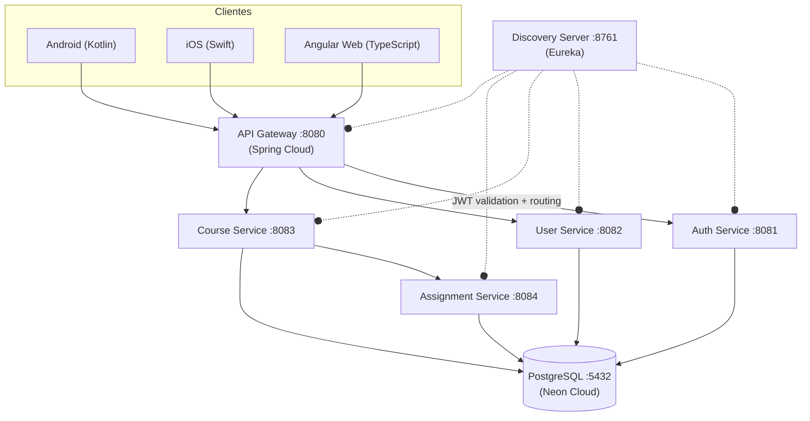
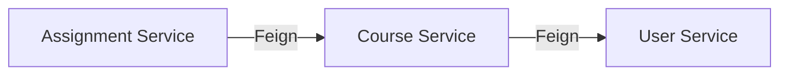
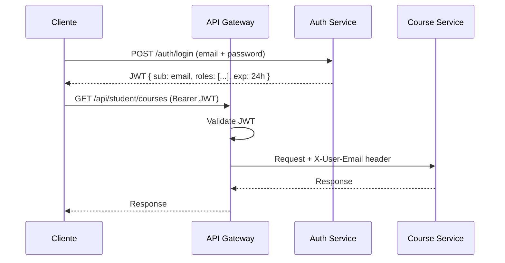
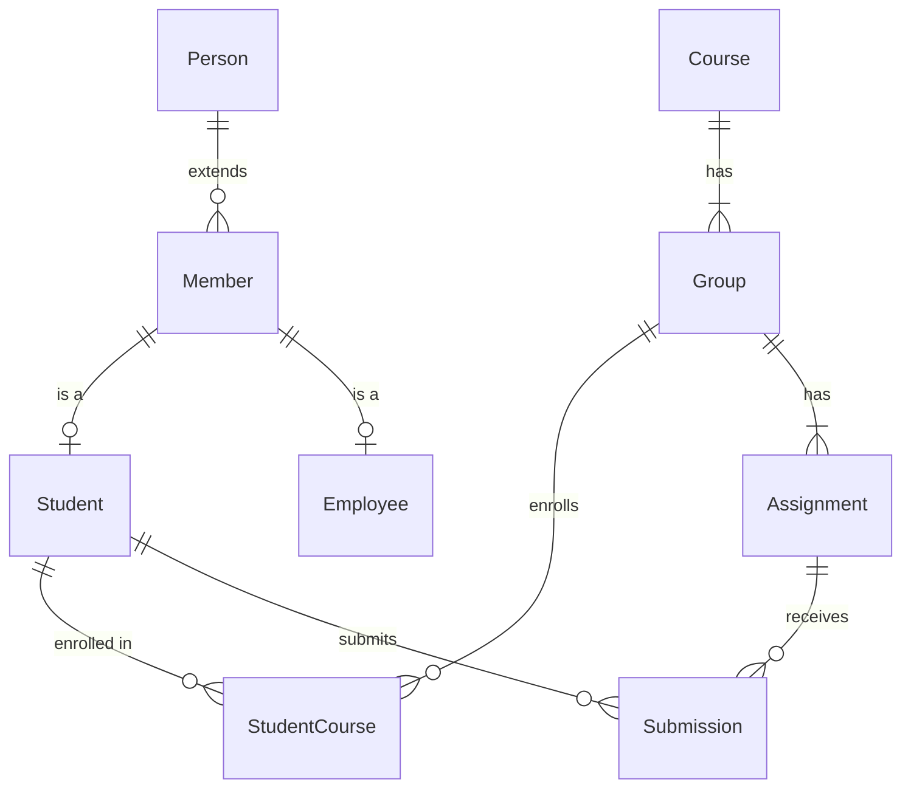

# K-APP · Documento de Diseño

> Versión 1.0 · Febrero 2026  
> Club de Desarrollo K-Forge · Fundación Universitaria Konrad Lorenz

---

## 1. Visión Arquitectónica

K-APP sigue una **arquitectura de microservicios** con Spring Cloud, migrando desde un monolito inicial. Cada servicio encapsula un dominio de negocio y se comunica vía REST + Eureka.

---

## 2. Stack Tecnológico

| Capa              | Tecnología                          |
| ----------------- | ----------------------------------- |
| Runtime           | Java 21, Spring Boot 3.2            |
| Cloud             | Spring Cloud 2023.0.0               |
| Discovery         | Netflix Eureka                      |
| Gateway           | Spring Cloud Gateway (reactive)     |
| Security          | Spring Security + JWT (JJWT 0.11.5) |
| Resilience        | Resilience4j Circuit Breaker        |
| IPC               | OpenFeign (sync REST)               |
| ORM               | Spring Data JPA + Hibernate         |
| Database          | PostgreSQL 15+ (Neon cloud)         |
| Build             | Maven (multi-module POM)            |
| Containers        | Docker + Docker Compose             |
| Frontend (web)    | Angular (planificado)               |
| Frontend (mobile) | Kotlin (Android), Swift (iOS)       |
| Package Manager   | Bun                                 |

---

## 3. Microservicios

### 3.1 Discovery Server `:8761`

- **Responsabilidad:** Registro y descubrimiento de servicios
- **Anotación:** `@EnableEurekaServer`
- **Dashboard:** `http://localhost:8761`

### 3.2 API Gateway `:8080`

- **Responsabilidad:** Punto de entrada único, routing, JWT validation, CORS
- **Componentes clave:**
  - `GatewayConfig` — Definición de rutas por servicio
  - `JwtAuthenticationFilter` — Filtro global de autenticación
  - `CorsConfig` — CORS centralizado
- **Flujo:**
  1. Request → JWT validation
  2. Extrae `X-User-Email` del token
  3. Ruta al microservicio correcto vía Eureka

### 3.3 Auth Service `:8081`

- **Responsabilidad:** Login, generación de JWT, validación de credenciales
- **Endpoint:** `POST /auth/login`
- **Roles:** `ROLE_STUDENT`, `ROLE_PROFESSOR`, `ROLE_ADMIN`
- **Seguridad:** BCrypt para passwords, HS512 para JWT

### 3.4 User Service `:8082`

- **Responsabilidad:** CRUD de personas, miembros, estudiantes, empleados
- **Endpoints externos:** `/api/admin/{people|members|students|employees}`
- **Endpoints internos:** `/api/users/internal/*` (Feign calls)

### 3.5 Course Service `:8083`

- **Responsabilidad:** Cursos, grupos, programas, matrículas
- **Dependencias:** User Service (vía Feign)
- **Endpoints:** `/api/student/courses`, `/api/professor/courses`, `/api/admin/courses`

### 3.6 Assignment Service `:8084`

- **Responsabilidad:** Tareas, entregas, calificaciones
- **Dependencias:** User Service + Course Service (vía Feign)
- **Endpoints:** `/api/student/assignments`, `/api/professor/assignments`

### 3.7 Common Library

- **Tipo:** Módulo Maven (no ejecutable)
- **Contenido:** DTOs, excepciones, `GlobalExceptionHandler`

---

## 4. Comunicación entre Servicios

- **Protocolo:** HTTP REST síncrono via OpenFeign
- **Discovery:** Eureka (por nombre de servicio)
- **Headers:** `X-User-Email` inyectado por API Gateway
- **Futuro:** Comunicación asíncrona con RabbitMQ/Kafka

---

## 5. Seguridad

### Flujo de Autenticación

### Capas de Seguridad

1. **API Gateway:** Validación JWT centralizada
2. **Servicios:** Confían en `X-User-Email` del Gateway
3. **Database:** Passwords hasheados con BCrypt
4. **CORS:** Configuración centralizada en Gateway
5. **Circuit Breaker:** Resilience4j para tolerancia a fallos

---

## 6. Modelo de Datos

### Diagrama ER (simplificado)

### Tablas Principales

| Tabla            | Servicio           | Descripción                   |
| ---------------- | ------------------ | ----------------------------- |
| `person`         | user-service       | Datos personales base         |
| `member`         | user-service       | Credenciales universitarias   |
| `student`        | user-service       | Info específica de estudiante |
| `employee`       | user-service       | Info específica de empleado   |
| `course`         | course-service     | Catálogo de cursos            |
| `course_group`   | course-service     | Grupos por curso              |
| `student_course` | course-service     | Matrículas                    |
| `assignment`     | assignment-service | Tareas                        |
| `submission`     | assignment-service | Entregas                      |
| `audit_log`      | shared             | Registro de auditoría         |

---

## 7. Configuración de Puertos

| Servicio           | Puerto | Container       |
| ------------------ | ------ | --------------- |
| Discovery Server   | 8761   | kapp-discovery  |
| API Gateway        | 8080   | kapp-gateway    |
| Auth Service       | 8081   | kapp-auth       |
| User Service       | 8082   | kapp-user       |
| Course Service     | 8083   | kapp-course     |
| Assignment Service | 8084   | kapp-assignment |
| PostgreSQL         | 5432   | (Neon cloud)    |

---

## 8. Decisiones de Diseño

| Decisión                      | Justificación                              |
| ----------------------------- | ------------------------------------------ |
| Microservicios sobre monolito | Escalado independiente, fault isolation    |
| Eureka sobre Consul/K8s DNS   | Integración nativa Spring Cloud            |
| JWT sobre sessions            | Stateless, escalable horizontalmente       |
| Feign sobre RestTemplate      | Declarativo, integración con Eureka        |
| BD compartida (por ahora)     | Simplicidad inicial, migrar a DB-per-svc   |
| Gateway reactivo              | Non-blocking I/O para routing              |
| Bun sobre npm                 | Rendimiento superior en resolución de deps |

---

## 9. Roadmap Técnico

1. ✅ Migración a microservicios
2. ✅ Service Discovery (Eureka)
3. ✅ API Gateway + JWT
4. ✅ Circuit Breaker
5. 🔲 Config Server centralizado
6. 🔲 Frontend Angular
7. 🔲 Frontend Kotlin (Android)
8. 🔲 Frontend Swift (iOS)
9. 🔲 Rate Limiting en Gateway
10. 🔲 Distributed Tracing (Zipkin)
11. 🔲 Message Queue (async communication)
12. 🔲 Database per service
13. 🔲 CI/CD Pipeline
14. 🔲 Kubernetes deployment

---

_Documento base — se expandirá conforme avance el desarrollo._
