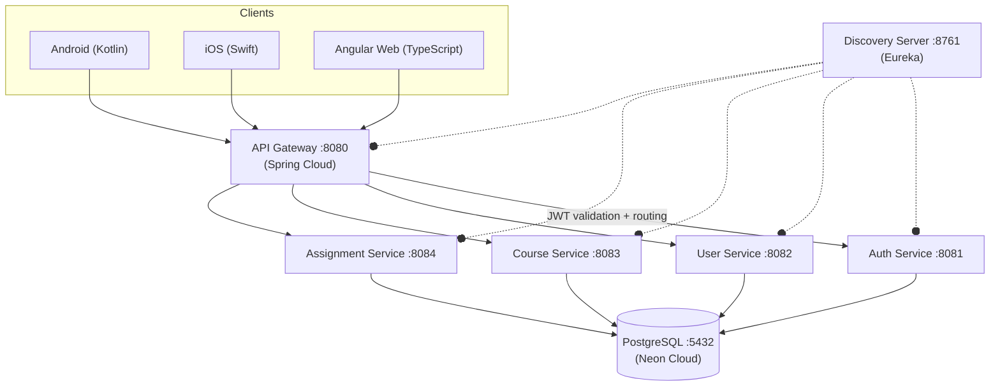
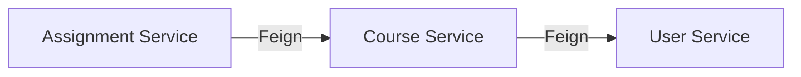
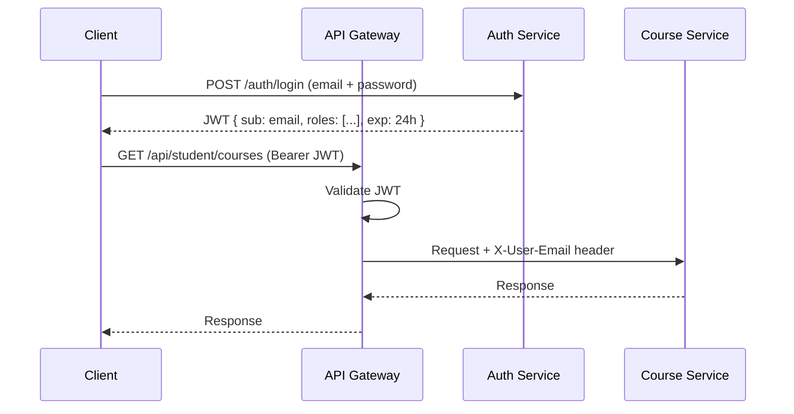
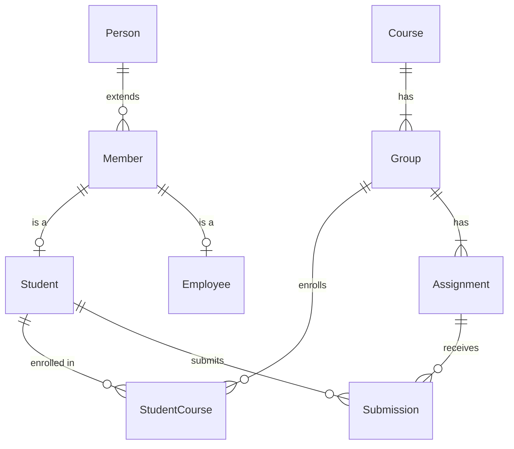

# KApp · Design Document

> Version 1.0 · February 2026
> K-Forge Development Club · Fundación Universitaria Konrad Lorenz

---

## 1. Architectural Vision

KApp is a mobile-first product: native Android (Kotlin) and iOS (Swift) clients on the device, and everything they
consume running server-side as a **microservices architecture** built on Spring Cloud, migrated from an initial
monolith that has since been deleted from the tree. Each service encapsulates a business domain and communicates
over REST with Eureka-based discovery.

Delivery is sequenced backend first, web second, mobile third: the web client exercises the API while the backend is
built and settles the interface design that the native clients will inherit.

```mermaid
graph TD
    subgraph Clients
        A["Android (Kotlin)"]
        B["iOS (Swift)"]
        C["Angular Web (TypeScript)"]
    end

    A & B & C --> GW["API Gateway :8080<br/>(Spring Cloud)"]

    GW -- "JWT validation + routing" --> AUTH["Auth Service :8081"]
    GW --> USER["User Service :8082"]
    GW --> COURSE["Course Service :8083"]
    GW --> ASSIGN["Assignment Service :8084"]

    EUREKA["Discovery Server :8761<br/>(Eureka)"] -.-o AUTH & USER & COURSE & ASSIGN & GW

    AUTH & USER & COURSE & ASSIGN --> DB[("PostgreSQL :5432<br/>(Neon Cloud)")]
```

---

## 2. Technology Stack

| Layer             | Technology                          |
| ----------------- | ----------------------------------- |
| Runtime           | Java 21, Spring Boot 3.2            |
| Cloud             | Spring Cloud 2023.0.0               |
| Discovery         | Netflix Eureka                      |
| Gateway           | Spring Cloud Gateway (reactive)     |
| Security          | Spring Security + JWT (JJWT 0.11.5) |
| Resilience        | Resilience4j circuit breaker        |
| IPC               | OpenFeign (synchronous REST)        |
| ORM               | Spring Data JPA + Hibernate         |
| Database          | PostgreSQL 15+ (Neon cloud)         |
| Build             | Maven (multi-module POM)            |
| Containers        | Docker + Docker Compose             |
| Frontend (web)    | HTML/CSS/JS today, Angular planned — API test surface and design reference |
| Frontend (mobile) | Kotlin (Android), Swift (iOS) — final product, not started |
| Package manager   | pnpm (dependencies) + Bun (scripts) |

---

## 3. Microservices

### 3.1 Discovery Server `:8761`

- **Responsibility:** service registration and discovery
- **Annotation:** `@EnableEurekaServer`
- **Dashboard:** `http://localhost:8761`

### 3.2 API Gateway `:8080`

- **Responsibility:** single entry point, routing, JWT validation, CORS
- **Key components:**
  - `GatewayConfig` — route definitions per service
  - `JwtAuthenticationFilter` — global authentication filter
  - `CorsConfig` — centralized CORS
- **Flow:**
  1. Request → JWT validation
  2. Extract `X-User-Email` from the token
  3. Route to the right microservice through Eureka

### 3.3 Auth Service `:8081`

- **Responsibility:** login, JWT generation, credential validation
- **Endpoint:** `POST /auth/login`
- **Roles:** `ROLE_STUDENT`, `ROLE_PROFESSOR`, `ROLE_ADMIN`
- **Security:** BCrypt for passwords, HS512 for JWT

### 3.4 User Service `:8082`

- **Responsibility:** CRUD for people, members, students and employees
- **External endpoints:** `/api/admin/{people|members|students|employees}`
- **Internal endpoints:** `/api/users/internal/*` (Feign calls)

### 3.5 Course Service `:8083`

- **Responsibility:** courses, groups, programs, enrollment
- **Dependencies:** User Service (through Feign)
- **Endpoints:** `/api/student/courses`, `/api/professor/courses`, `/api/admin/courses`

### 3.6 Assignment Service `:8084`

- **Responsibility:** assignments, submissions, grading
- **Dependencies:** User Service + Course Service (through Feign)
- **Endpoints:** `/api/student/assignments`, `/api/professor/assignments`

### 3.7 Common Library

- **Type:** Maven module (not executable)
- **Contents:** DTOs, exceptions, `GlobalExceptionHandler`

---

## 4. Service-to-Service Communication

```mermaid
graph LR
    ASSIGN["Assignment Service"] -- Feign --> COURSE["Course Service"] -- Feign --> USER["User Service"]
```

- **Protocol:** synchronous HTTP REST through OpenFeign
- **Discovery:** Eureka (by service name)
- **Headers:** `X-User-Email` injected by the API Gateway
- **Future:** asynchronous communication with RabbitMQ/Kafka

---

## 5. Security

### Authentication Flow

```mermaid
sequenceDiagram
    participant C as Client
    participant GW as API Gateway
    participant AUTH as Auth Service
    participant SVC as Course Service

    C->>AUTH: POST /auth/login (email + password)
    AUTH-->>C: JWT { sub: email, roles: [...], exp: 24h }

    C->>GW: GET /api/student/courses (Bearer JWT)
    GW->>GW: Validate JWT
    GW->>SVC: Request + X-User-Email header
    SVC-->>GW: Response
    GW-->>C: Response
```

### Security Layers

1. **API Gateway:** centralized JWT validation
2. **Services:** trust the `X-User-Email` header set by the Gateway
3. **Database:** passwords hashed with BCrypt
4. **CORS:** centralized configuration at the Gateway
5. **Circuit breaker:** Resilience4j for fault tolerance

> Design assumption under review: layer 2 only holds while the services are unreachable from outside the gateway,
> and the current setup does not guarantee that. Role enforcement is also missing. Both gaps are documented in
> [SECURITY-AUDIT.md](SECURITY-AUDIT.md), findings S1 and S2.

---

## 6. Data Model

### ER Diagram (simplified)

```mermaid
erDiagram
    Person ||--o{ Member : "extends"
    Member ||--o| Student : "is a"
    Member ||--o| Employee : "is a"

    Course ||--|{ Group : "has"
    Group ||--o{ StudentCourse : "enrolls"
    Student ||--o{ StudentCourse : "enrolled in"
    Group ||--|{ Assignment : "has"
    Assignment ||--o{ Submission : "receives"
    Student ||--o{ Submission : "submits"
```

### Main Tables

| Table            | Service            | Description                |
| ---------------- | ------------------ | -------------------------- |
| `person`         | user-service       | Base personal data         |
| `member`         | user-service       | University credentials     |
| `student`        | user-service       | Student-specific data      |
| `employee`       | user-service       | Employee-specific data     |
| `course`         | course-service     | Course catalog             |
| `course_group`   | course-service     | Groups per course          |
| `student_course` | course-service     | Enrollments                |
| `assignment`     | assignment-service | Assignments                |
| `submission`     | assignment-service | Submissions                |
| `audit_log`      | shared             | Audit trail                |

---

## 7. Port Configuration

| Service            | Port   | Container       |
| ------------------ | ------ | --------------- |
| Discovery Server   | 8761   | kapp-discovery  |
| API Gateway        | 8080   | kapp-gateway    |
| Auth Service       | 8081   | kapp-auth       |
| User Service       | 8082   | kapp-user       |
| Course Service     | 8083   | kapp-course     |
| Assignment Service | 8084   | kapp-assignment |
| PostgreSQL         | 5432   | (Neon cloud)    |

---

## 8. Design Decisions

| Decision                        | Rationale                                        |
| ------------------------------- | ------------------------------------------------ |
| Microservices over a monolith   | Independent scaling, fault isolation              |
| Eureka over Consul / K8s DNS    | Native Spring Cloud integration                   |
| JWT over server-side sessions   | Stateless, horizontally scalable                  |
| Feign over RestTemplate         | Declarative, integrated with Eureka               |
| Shared database (for now)       | Initial simplicity; migrate to database-per-service |
| Reactive gateway                | Non-blocking I/O for routing                      |
| pnpm + Bun                      | pnpm for dependencies, Bun to run scripts         |

---

## 9. Technical Roadmap

Ordered by the delivery sequence — harden the backend, settle the design on web, then port to mobile. Kept in sync
with `PROGRESS.md` and `AGENTS.md`.

1. [X] Migration to microservices
2. [X] Service discovery (Eureka)
3. [X] API Gateway + JWT
4. [X] Circuit breaker
5. [X] CI build pipeline (GitHub Actions)
6. [ ] Role-based authorization enforcement
7. [ ] Centralized Config Server
8. [ ] Angular frontend — reference design for the mobile clients
9. [ ] Refresh tokens and logout
10. [ ] Rate limiting at the Gateway
11. [ ] Kotlin frontend (Android)
12. [ ] Swift frontend (iOS)
13. [ ] Continuous deployment
14. [ ] Distributed tracing (Zipkin)
15. [ ] Message queue (asynchronous communication)
16. [ ] Database per service
17. [ ] Kubernetes deployment

---

_Baseline document — it will grow as development advances._
