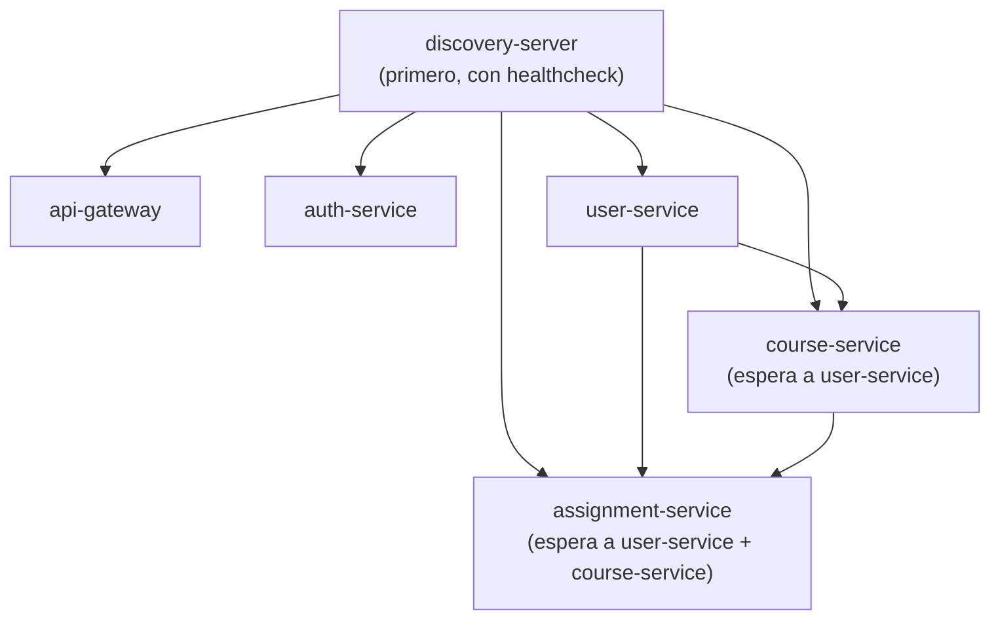

# K-APP · Guía de Containerización con Docker Desktop

> Guía paso a paso para contenerizar y ejecutar los microservicios en Docker Desktop.

---

## 1. Prerrequisitos

| Herramienta    | Versión mínima | Instalación                                    |
| -------------- | -------------- | ---------------------------------------------- |
| Docker Desktop | 4.x            | https://www.docker.com/products/docker-desktop |
| Java           | 21             | Solo para compilar (no en runtime Docker)      |
| Maven          | 3.9+           | Incluido como wrapper (`mvnw`)                 |

Verificar instalación:

```bash
docker --version
docker compose version
java -version
```

---

## 2. Estructura de Archivos Docker

```
backend/microservices/
├── docker-compose.yml          # Orquestación de todos los servicios
├── discovery-server/Dockerfile
├── api-gateway/Dockerfile
├── auth-service/Dockerfile
├── user-service/Dockerfile
├── course-service/Dockerfile
└── assignment-service/Dockerfile
```

---

## 3. Compilar los Microservicios

Antes de contenerizar, compilar todos los módulos:

```bash
cd backend/microservices
./mvnw clean package -DskipTests
```

> Esto genera los `.jar` en `{service}/target/`.

---

## 4. Dockerfile (ejemplo)

Cada microservicio ya tiene su `Dockerfile`. Ejemplo estándar:

```dockerfile
# Stage 1: Build
FROM maven:3.9-eclipse-temurin-21-alpine AS build
WORKDIR /app
COPY pom.xml .
COPY src ./src
RUN mvn clean package -DskipTests

# Stage 2: Run
FROM eclipse-temurin:21-jre-alpine
WORKDIR /app
COPY --from=build /app/target/*.jar app.jar
EXPOSE 8081
ENTRYPOINT ["java", "-jar", "app.jar"]
```

**Mejores prácticas:**

- Multi-stage build (imagen final sin Maven/JDK)
- Base `alpine` para imágenes ligeras (~150MB)
- `EXPOSE` documenta el puerto del servicio

---

## 5. Levantar con Docker Compose

### 5.1 Configurar variables de entorno

Crear archivo `.env` en `backend/microservices/`:

```env
PGHOST=tu-host-postgresql
PGDATABASE=tu-database
PGUSER=tu-usuario
PGPASSWORD=tu-password
PGSSLMODE=require
```

### 5.2 Levantar todos los servicios

```bash
cd backend/microservices
docker compose up -d --build
```

### 5.3 Verificar estado

```bash
# Ver servicios en ejecución
docker compose ps

# Ver logs en tiempo real
docker compose logs -f

# Logs de un servicio específico
docker compose logs -f api-gateway
```

### 5.4 Verificar en Docker Desktop

1. Abrir **Docker Desktop**
2. Ir a la pestaña **Containers**
3. Buscar el grupo `microservices`
4. Verificar que todos los contenedores estén en estado **Running** (verde)

---

## 6. Orden de Inicio (automático)

Docker Compose maneja las dependencias:



---

## 7. URLs del Sistema

| Servicio           | URL Local             | Contenedor      |
| ------------------ | --------------------- | --------------- |
| Eureka Dashboard   | http://localhost:8761 | kapp-discovery  |
| API Gateway        | http://localhost:8080 | kapp-gateway    |
| Auth Service       | http://localhost:8081 | kapp-auth       |
| User Service       | http://localhost:8082 | kapp-user       |
| Course Service     | http://localhost:8083 | kapp-course     |
| Assignment Service | http://localhost:8084 | kapp-assignment |

---

## 8. Comandos Frecuentes

```bash
# Levantar servicios (rebuild)
docker compose up -d --build

# Detener servicios
docker compose down

# Detener y eliminar volúmenes
docker compose down -v

# Rebuild de un solo servicio
docker compose up -d --build auth-service

# Ver logs en tiempo real
docker compose logs -f

# Restart de un servicio
docker compose restart user-service

# Ejecutar shell dentro de un contenedor
docker exec -it kapp-auth sh

# Ver uso de recursos
docker stats
```

---

## 9. Troubleshooting

### El servicio no arranca

```bash
# Ver logs detallados
docker compose logs auth-service

# Verificar que la imagen se compiló bien
docker compose build auth-service
```

### Error de conexión a la base de datos

```bash
# Verificar variables de entorno
docker compose config

# Verificar conectividad desde el contenedor
docker exec -it kapp-auth sh -c "curl -v $PGHOST:5432"
```

### Eureka no registra un servicio

```bash
# Verificar que discovery-server está healthy
docker inspect kapp-discovery | grep -A5 Health

# Verificar la URL de Eureka en el servicio
docker exec -it kapp-auth env | grep EUREKA
```

### Limpiar todo y reiniciar

```bash
docker compose down -v --rmi all
docker system prune -f
docker compose up -d --build
```

---

## 10. Optimización de Imágenes

### Reducir tamaño de imagen

```dockerfile
# Usar JRE en vez de JDK
FROM eclipse-temurin:21-jre-alpine

# Agregar .dockerignore en cada servicio
# Contenido sugerido:
target/
*.md
.git
.idea
```

### Caché de dependencias Maven

```dockerfile
# Copiar pom.xml primero para aprovechar caché
COPY pom.xml .
RUN mvn dependency:go-offline
COPY src ./src
RUN mvn package -DskipTests
```

---

## 11. Producción (consideraciones)

- [ ] Usar Docker secrets en lugar de variables `.env`
- [ ] Implementar health checks en todos los servicios
- [ ] Configurar límites de CPU/memoria por contenedor
- [ ] Usar un registry privado para las imágenes
- [ ] Considerar Kubernetes para orquestación en producción
- [ ] Implementar logging centralizado (ELK/Loki)
- [ ] Configurar alertas con Prometheus + Grafana

---

_Para más detalles sobre la arquitectura, ver [`docs/DESIGN.md`](./DESIGN.md)._
