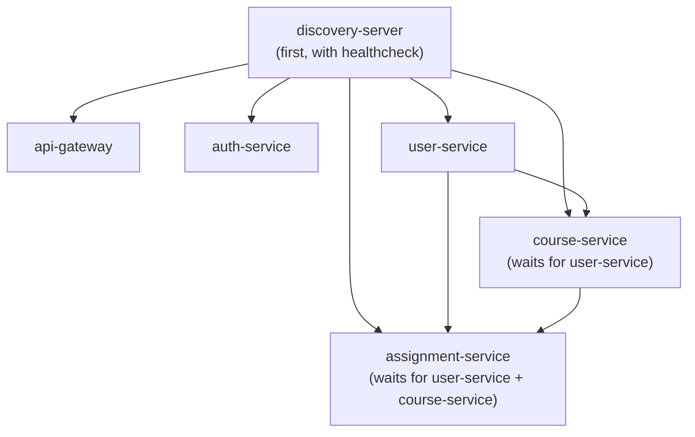

# KApp · Containerization Guide with Docker Desktop

> Step-by-step guide to containerize and run the microservices on Docker Desktop.

---

## 1. Prerequisites

| Tool           | Minimum version | Installation                                   |
| -------------- | --------------- | ---------------------------------------------- |
| Docker Desktop | 4.x             | https://www.docker.com/products/docker-desktop |
| Java           | 21              | Build only (not needed in the Docker runtime)  |
| Maven          | 3.9+            | Included as a wrapper (`mvnw`)                 |

Verify the installation:

```bash
docker --version
docker compose version
java -version
```

---

## 2. Docker File Layout

```
app/backend/microservices/
├── docker-compose.yml          # Orchestration for all services
├── discovery-server/Dockerfile
├── api-gateway/Dockerfile
├── auth-service/Dockerfile
├── user-service/Dockerfile
├── course-service/Dockerfile
└── assignment-service/Dockerfile
```

---

## 3. Build the Microservices

Before containerizing, build every module:

```bash
cd app/backend/microservices
./mvnw clean package -DskipTests
```

> This produces the `.jar` files under `{service}/target/`.

---

## 4. Dockerfile (example)

Every microservice already has its own `Dockerfile`. Standard example:

```dockerfile
# Stage 1: Build
FROM maven:3.9-eclipse-temurin-21-alpine AS build
WORKDIR /app
COPY pom.xml .
COPY src ./src
RUN mvn clean package -DskipTests

# Stage 2: Run
FROM eclipse-temurin:21-jre-alpine
WORKDIR /app
COPY --from=build /app/target/*.jar app.jar
EXPOSE 8081
ENTRYPOINT ["java", "-jar", "app.jar"]
```

**Best practices:**

- Multi-stage build (final image without Maven/JDK)
- `alpine` base for lightweight images (around 150 MB)
- `EXPOSE` documents the service port

---

## 5. Start with Docker Compose

### 5.1 Configure environment variables

Create a `.env` file in `app/backend/microservices/` (see [`.env.example`](../.env.example) at the repository root
for the full list):

```env
PGHOST=your-postgresql-host
PGDATABASE=your-database
PGUSER=your-user
PGPASSWORD=your-password
PGSSLMODE=require
JWT_SECRET=your-64-byte-minimum-secret
```

### 5.2 Start every service

```bash
cd app/backend/microservices
docker compose up -d --build
```

### 5.3 Check the status

```bash
# List running services
docker compose ps

# Follow logs in real time
docker compose logs -f

# Logs for a specific service
docker compose logs -f api-gateway
```

### 5.4 Check in Docker Desktop

1. Open **Docker Desktop**
2. Go to the **Containers** tab
3. Look for the `microservices` group
4. Confirm every container is **Running** (green)

---

## 6. Startup Order (automatic)

Docker Compose resolves the dependencies:


```mermaid
graph TD
    DS["discovery-server<br/>(first, with healthcheck)"] --> GW[api-gateway]
    DS --> AUTH[auth-service]
    DS --> USER[user-service]
    DS --> COURSE["course-service<br/>(waits for user-service)"]
    DS --> ASSIGN["assignment-service<br/>(waits for user-service + course-service)"]
    USER --> COURSE
    USER --> ASSIGN
    COURSE --> ASSIGN
```

---

## 7. System URLs

| Service            | Local URL             | Container       |
| ------------------ | --------------------- | --------------- |
| Eureka dashboard   | http://localhost:8761 | kapp-discovery  |
| API Gateway        | http://localhost:8080 | kapp-gateway    |
| Auth Service       | http://localhost:8081 | kapp-auth       |
| User Service       | http://localhost:8082 | kapp-user       |
| Course Service     | http://localhost:8083 | kapp-course     |
| Assignment Service | http://localhost:8084 | kapp-assignment |

> Publishing ports 8081-8084 is a local development convenience. It also makes the domain services reachable without
> going through the gateway: see [SECURITY-AUDIT.md](SECURITY-AUDIT.md), finding S1.

---

## 8. Common Commands

```bash
# Start services (rebuild)
docker compose up -d --build

# Stop services
docker compose down

# Stop and remove volumes
docker compose down -v

# Rebuild a single service
docker compose up -d --build auth-service

# Follow logs in real time
docker compose logs -f

# Restart a service
docker compose restart user-service

# Open a shell inside a container
docker exec -it kapp-auth sh

# Inspect resource usage
docker stats
```

---

## 9. Troubleshooting

### A service does not start

```bash
# Detailed logs
docker compose logs auth-service

# Confirm the image builds
docker compose build auth-service
```

### Database connection error

```bash
# Check environment variables
docker compose config

# Check connectivity from inside the container
docker exec -it kapp-auth sh -c "curl -v $PGHOST:5432"
```

### Eureka does not register a service

```bash
# Confirm discovery-server is healthy
docker inspect kapp-discovery | grep -A5 Health

# Check the Eureka URL used by the service
docker exec -it kapp-auth env | grep EUREKA
```

### Clean everything and restart

```bash
docker compose down -v --rmi all
docker system prune -f
docker compose up -d --build
```

---

## 10. Image Optimization

### Reduce image size

```dockerfile
# Use the JRE instead of the JDK
FROM eclipse-temurin:21-jre-alpine

# Add a .dockerignore in each service
# Suggested contents:
target/
*.md
.git
.idea
```

### Maven dependency cache

```dockerfile
# Copy pom.xml first to take advantage of layer caching
COPY pom.xml .
RUN mvn dependency:go-offline
COPY src ./src
RUN mvn package -DskipTests
```

---

## 11. Production Considerations

- [ ] Use Docker secrets instead of `.env` variables
- [ ] Keep service ports internal to the container network; expose only the gateway
- [ ] Implement health checks on every service
- [ ] Configure CPU/memory limits per container
- [ ] Use a private registry for the images
- [ ] Consider Kubernetes for production orchestration
- [ ] Implement centralized logging (ELK/Loki)
- [ ] Configure alerting with Prometheus + Grafana

---

_For more detail on the architecture, see [`docs/DESIGN.md`](./DESIGN.md)._
