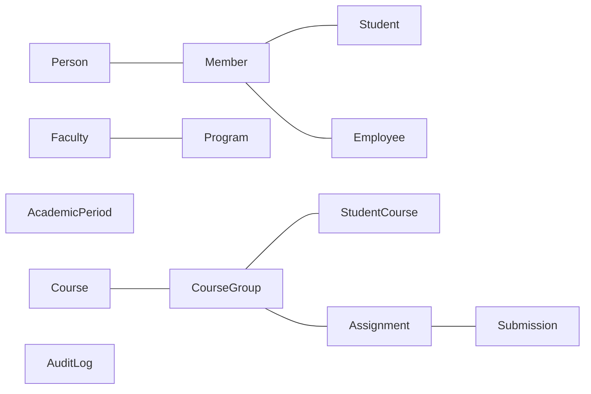

# K-APP · Documento de Requerimientos

> Versión 1.0 · Febrero 2026  
> Club de Desarrollo K-Forge · Fundación Universitaria Konrad Lorenz

---

## 1. Descripción General

K-APP es una plataforma universitaria que centraliza servicios académicos y administrativos para estudiantes, profesores y administradores de la Fundación Universitaria Konrad Lorenz.

**Objetivo:** Mejorar la experiencia universitaria mediante una arquitectura de microservicios moderna, accesible desde web y aplicaciones móviles nativas.

---

## 2. Actores del Sistema

| Actor          | Descripción                                      |
| -------------- | ------------------------------------------------ |
| **Estudiante** | Consulta cursos, tareas, notas y horarios        |
| **Profesor**   | Gestiona cursos, crea tareas, califica entregas  |
| **Admin**      | CRUD completo de usuarios, cursos y asignaciones |
| **Sistema**    | Procesos automáticos (JWT, auditoría, registro)  |

---

## 3. Requerimientos Funcionales

### 3.1 Autenticación y Autorización (AUTH)

| ID      | Requisito                                               | Prioridad |
| ------- | ------------------------------------------------------- | --------- |
| AUTH-01 | Login con email institucional y contraseña              | Alta      |
| AUTH-02 | Generación de JWT con roles (STUDENT, PROFESSOR, ADMIN) | Alta      |
| AUTH-03 | Expiración de tokens configurable (default 24h)         | Alta      |
| AUTH-04 | Validación centralizada de JWT en API Gateway           | Alta      |
| AUTH-05 | Hash de contraseñas con BCrypt                          | Alta      |
| AUTH-06 | Logout (invalidación de token) — futuro                 | Media     |
| AUTH-07 | Refresh token — futuro                                  | Media     |

### 3.2 Gestión de Usuarios (USER)

| ID      | Requisito                                            | Prioridad |
| ------- | ---------------------------------------------------- | --------- |
| USER-01 | CRUD de personas (datos personales)                  | Alta      |
| USER-02 | CRUD de miembros (credenciales universitarias)       | Alta      |
| USER-03 | CRUD de estudiantes (programa, semestre, estado)     | Alta      |
| USER-04 | CRUD de empleados (tipo, contrato, rol)              | Alta      |
| USER-05 | Endpoints internos para comunicación entre servicios | Alta      |
| USER-06 | Búsqueda por email para resolución de identidad      | Alta      |

### 3.3 Gestión de Cursos (COURSE)

| ID        | Requisito                                   | Prioridad |
| --------- | ------------------------------------------- | --------- |
| COURSE-01 | CRUD de cursos y grupos                     | Alta      |
| COURSE-02 | Matrícula de estudiantes en grupos          | Alta      |
| COURSE-03 | Consulta de cursos inscritos por estudiante | Alta      |
| COURSE-04 | Consulta de cursos impartidos por profesor  | Alta      |
| COURSE-05 | Listado de estudiantes por grupo            | Alta      |
| COURSE-06 | Gestión de programas académicos             | Media     |
| COURSE-07 | Gestión de periodos académicos              | Media     |

### 3.4 Gestión de Tareas (ASSIGNMENT)

| ID        | Requisito                                    | Prioridad |
| --------- | -------------------------------------------- | --------- |
| ASSIGN-01 | Creación de tareas por profesor              | Alta      |
| ASSIGN-02 | Consulta de tareas pendientes por estudiante | Alta      |
| ASSIGN-03 | Entrega de tareas (submissions)              | Alta      |
| ASSIGN-04 | Calificación de entregas con feedback        | Alta      |
| ASSIGN-05 | Historial de tareas entregadas               | Media     |
| ASSIGN-06 | Notificaciones de tareas próximas — futuro   | Baja      |

### 3.5 Infraestructura (INFRA)

| ID       | Requisito                               | Prioridad |
| -------- | --------------------------------------- | --------- |
| INFRA-01 | Service Discovery con Eureka            | Alta      |
| INFRA-02 | API Gateway como punto de entrada único | Alta      |
| INFRA-03 | Circuit Breaker con Resilience4j        | Media     |
| INFRA-04 | Config Server centralizado — futuro     | Media     |
| INFRA-05 | Distributed Tracing (Zipkin) — futuro   | Baja      |
| INFRA-06 | Message Queue (RabbitMQ/Kafka) — futuro | Baja      |

### 3.6 Frontend (FRONT)

| ID       | Requisito                                         | Prioridad |
| -------- | ------------------------------------------------- | --------- |
| FRONT-01 | Web app con Angular para visualización de avances | Alta      |
| FRONT-02 | App nativa Android con Kotlin — futuro            | Media     |
| FRONT-03 | App nativa iOS con Swift — futuro                 | Media     |
| FRONT-04 | Diseño responsivo y accesible                     | Alta      |

---

## 4. Requerimientos No Funcionales

| ID     | Categoría      | Requisito                                      |
| ------ | -------------- | ---------------------------------------------- |
| NFR-01 | Seguridad      | JWT stateless, CORS configurado, HTTPS en prod |
| NFR-02 | Rendimiento    | Respuesta < 500ms en endpoints principales     |
| NFR-03 | Disponibilidad | Fallo aislado por servicio (fault isolation)   |
| NFR-04 | Escalabilidad  | Servicios independientes, escalado horizontal  |
| NFR-05 | Mantenibilidad | Código limpio, DTOs compartidos, logs estándar |
| NFR-06 | Portabilidad   | Containerización Docker, CI/CD compatible      |
| NFR-07 | Auditoría      | Logging de operaciones CRUD en audit_log       |

---

## 5. Restricciones

- **Base de datos:** PostgreSQL 15+ (Neon cloud en desarrollo)
- **Java:** 21+
- **Spring Boot:** 3.2+
- **Uso interno:** Solo comunidad Konrad Lorenz
- **Paquetes frontend:** Bun como package manager

---

## 6. Entidades del Dominio

---

## 7. Mapa de Endpoints

| Ruta                         | Servicio      | Acceso    |
| ---------------------------- | ------------- | --------- |
| `POST /auth/login`           | auth-service  | Público   |
| `GET  /api/student/*`        | course/assign | STUDENT   |
| `GET  /api/professor/*`      | course/assign | PROFESSOR |
| `CRUD /api/admin/*`          | user/course   | ADMIN     |
| `GET  /api/users/internal/*` | user-service  | Interno   |

---

_Documento base — se expandirá conforme avance el desarrollo._
