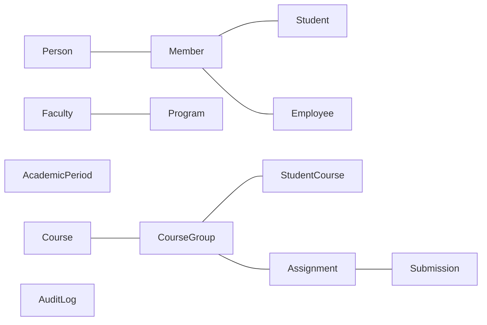

# KApp · Requirements Document

> Version 1.0 · February 2026
> K-Forge Development Club · Fundación Universitaria Konrad Lorenz

---

## 1. General Description

KApp is a university platform that centralizes academic and administrative services for students, professors and
administrators of Fundación Universitaria Konrad Lorenz.

**Goal:** improve the university experience through a modern microservices architecture, accessible from the web and
from native mobile applications.

---

## 2. System Actors

| Actor          | Description                                          |
| -------------- | ---------------------------------------------------- |
| **Student**    | Consults courses, assignments, grades and schedules   |
| **Professor**  | Manages courses, creates assignments, grades work     |
| **Admin**      | Full CRUD over users, courses and assignments         |
| **System**     | Automated processes (JWT, auditing, registration)     |

---

## 3. Functional Requirements

### 3.1 Authentication and Authorization (AUTH)

| ID      | Requirement                                              | Priority |
| ------- | -------------------------------------------------------- | -------- |
| AUTH-01 | Login with institutional e-mail and password             | High     |
| AUTH-02 | JWT generation with roles (STUDENT, PROFESSOR, ADMIN)    | High     |
| AUTH-03 | Configurable token expiry (default 24 h)                 | High     |
| AUTH-04 | Centralized JWT validation at the API Gateway            | High     |
| AUTH-05 | Password hashing with BCrypt                             | High     |
| AUTH-06 | Logout (token invalidation) — future                     | Medium   |
| AUTH-07 | Refresh token — future                                   | Medium   |

### 3.2 User Management (USER)

| ID      | Requirement                                              | Priority |
| ------- | -------------------------------------------------------- | -------- |
| USER-01 | Person CRUD (personal data)                              | High     |
| USER-02 | Member CRUD (university credentials)                     | High     |
| USER-03 | Student CRUD (program, semester, status)                 | High     |
| USER-04 | Employee CRUD (type, contract, role)                     | High     |
| USER-05 | Internal endpoints for service-to-service communication  | High     |
| USER-06 | Lookup by e-mail for identity resolution                 | High     |

### 3.3 Course Management (COURSE)

| ID        | Requirement                                  | Priority |
| --------- | -------------------------------------------- | -------- |
| COURSE-01 | Course and group CRUD                        | High     |
| COURSE-02 | Student enrollment into groups               | High     |
| COURSE-03 | Query enrolled courses per student           | High     |
| COURSE-04 | Query taught courses per professor           | High     |
| COURSE-05 | List students per group                      | High     |
| COURSE-06 | Academic program management                  | Medium   |
| COURSE-07 | Academic period management                   | Medium   |

### 3.4 Assignment Management (ASSIGNMENT)

| ID        | Requirement                                     | Priority |
| --------- | ----------------------------------------------- | -------- |
| ASSIGN-01 | Assignment creation by professors               | High     |
| ASSIGN-02 | Query pending assignments per student           | High     |
| ASSIGN-03 | Assignment submissions                          | High     |
| ASSIGN-04 | Grading of submissions with feedback            | High     |
| ASSIGN-05 | History of submitted assignments                | Medium   |
| ASSIGN-06 | Notifications for upcoming assignments — future | Low      |

### 3.5 Infrastructure (INFRA)

| ID       | Requirement                                | Priority |
| -------- | ------------------------------------------ | -------- |
| INFRA-01 | Service discovery with Eureka              | High     |
| INFRA-02 | API Gateway as single entry point          | High     |
| INFRA-03 | Circuit breaker with Resilience4j          | Medium   |
| INFRA-04 | Centralized Config Server — future         | Medium   |
| INFRA-05 | Distributed tracing (Zipkin) — future      | Low      |
| INFRA-06 | Message queue (RabbitMQ/Kafka) — future    | Low      |

### 3.6 Frontend (FRONT)

| ID       | Requirement                                    | Priority |
| -------- | ---------------------------------------------- | -------- |
| FRONT-01 | Angular web app for progress visualization     | High     |
| FRONT-02 | Native Android app with Kotlin — future        | Medium   |
| FRONT-03 | Native iOS app with Swift — future             | Medium   |
| FRONT-04 | Responsive and accessible design               | High     |

---

## 4. Non-Functional Requirements

| ID     | Category        | Requirement                                              |
| ------ | --------------- | -------------------------------------------------------- |
| NFR-01 | Security        | Stateless JWT, configured CORS, HTTPS in production       |
| NFR-02 | Performance     | Under 500 ms response time on primary endpoints           |
| NFR-03 | Availability    | Fault isolation per service                               |
| NFR-04 | Scalability     | Independent services, horizontal scaling                  |
| NFR-05 | Maintainability | Clean code, shared DTOs, standard logging                 |
| NFR-06 | Portability     | Docker containerization, CI/CD compatible                 |
| NFR-07 | Auditability    | CRUD operation logging in `audit_log`                     |

---

## 5. Constraints

- **Database:** PostgreSQL 15+ (Neon cloud during development)
- **Java:** 21+
- **Spring Boot:** 3.2+
- **Internal use:** Konrad Lorenz community only
- **Frontend packages:** pnpm to install dependencies, Bun to run scripts

---

## 6. Domain Entities

```mermaid
graph LR
    Person --- Member
    Member --- Student
    Member --- Employee

    Faculty --- Program
    AcademicPeriod

    Course --- CourseGroup --- StudentCourse
    CourseGroup --- Assignment --- Submission

    AuditLog
```

---

## 7. Endpoint Map

| Route                        | Service       | Access    |
| ---------------------------- | ------------- | --------- |
| `POST /auth/login`           | auth-service  | Public    |
| `GET  /api/student/*`        | course/assign | STUDENT   |
| `GET  /api/professor/*`      | course/assign | PROFESSOR |
| `CRUD /api/admin/*`          | user/course   | ADMIN     |
| `GET  /api/users/internal/*` | user-service  | Internal  |

> Access column states the intended policy. Enforcement is not implemented yet: see `SECURITY-AUDIT.md`,
> findings S1 and S2.

---

_Baseline document — it will grow as development advances._
